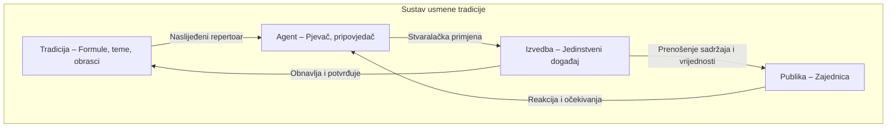

# Procedura: proizvodnja kvalitetnog dijagrama (Mermaid → SVG)

Kratki vodič kako dobiti **čist, čitljiv SVG dijagram** s natpisima na bridovima uz liniju, bez naopakog teksta i s prilagođenim fontom. Namijenjeno drugim agentima i ljudima koji rade u ovom repozitoriju.

---

## Preduvjeti

- **Node.js** instaliran
- U rootu projekta: **`npm install`** (instalira `beautiful-mermaid`)

---

## Korak 1: Napiši Mermaid izvor (`.mmd`)

1. Kreiraj ili uredi datoteku u **`docs/diagrams/`** s nastavkom **`.mmd`** (npr. `docs/diagrams/moj_dijagram.mmd`).

2. **Koristi ovu sintaksu** (bitno za kvalitetan rezultat):

   - **Smjer:** `graph TD` (gore–dolje). S `graph LR` i natpisima na bridovima linije se ponekad ne crtaju.
   - **Natpisi na bridovima:** samo **pipe** sintaksa:  
     `A -->|Tekst natpisa| B`  
     **Ne** koristi `A --"Tekst"--> B` — beautiful-mermaid to ne parsira ispravno i linije nestanu.
   - **Čvorovi:** `Id[Opis čvora]` ili `Id(Opis)` — u uglatim zagradama radi stabilno.
   - **Subgraph:** možeš koristiti `subgraph "Naslov" ... end`.

3. **Primjer ispravnog izvora** (vidi `usmena_tradicija.mmd`):



4. **Što izbjegavati:**
   - `--"label"-->` (navodnici na bridovima)
   - Prekompleksne oblike čvorova s HTML-om (`<br/>`, `<i>`) ako želiš stabilan SVG
   - `graph LR` ako imaš natpise na bridovima (može dati prazan SVG)
   - Linije `style id fill:...` — za knjigu svi čvorovi koriste isti (default) stil.

5. **Ujednačen stil za knjigu:** Svi čvorovi u obliku `Id[Label]` (uglate zagrade), bez HTML-a i bez `style` linija. Ako imaš više dijagrama s miješanim stilovima, pokreni:
   ```bash
   python scripts/unify_diagram_style.py
   ```
   Skripta uklanja HTML (`<br>`, `<i>`, `<b>` itd.), briše linije `style ...` i pretvara sve oblike čvorova u `[Label]`.

---

## Korak 2: Render u SVG (beautiful-mermaid)

Iz roota projekta:

```bash
node scripts/render_mermaid.mjs -f docs/diagrams/ime_dijagrama.mmd -o docs/diagrams/ime_dijagrama.svg
```

- Zamijeni `ime_dijagrama` s imenom tvog `.mmd` (bez nastavka).
- Rezultat: `docs/diagrams/ime_dijagrama.svg` s čvorovima, linijama i natpisima u okvirima.

---

## Korak 3: Post-proces (labele uz liniju, čišćenje)

Da natpisi na bridovima **prate liniju** (textPath), budu **na sredini** segmenta, **ne naopako**, s **manjim i užim fontom** i **izraženijom bojom**:

```bash
node scripts/svg_edge_labels_along_path.mjs -f docs/diagrams/ime_dijagrama.svg -o docs/diagrams/ime_dijagrama.svg
```

- **Ulaz i izlaz:** ista datoteka (prepisuje se).
- Što skripta radi:
  - Uklanja okvire (rect) oko natpisa na bridovima.
  - Koristi samo **srednji segment** svake linije za textPath (bolje centriranje).
  - **Okreće** segment ako bi tekst bio naopako (npr. kad linija ide prema gore).
  - Postavlja **font-size 8**, **punu prednju boju** (`var(--_text)`), **letter-spacing 0.04em**, **font-stretch: condensed**.

---

## Jednoklik: svi dijagrami odjednom

Iz roota projekta:

```bash
python scripts/render_diagrams.py
```

- Pronalazi sve **`docs/diagrams/*.mmd`**.
- Za svaki: pokreće **Korak 2** (render u SVG), zatim **Korak 3** (post-proces).
- Ispis: `Rendered: ime.mmd -> ime.svg` i `-> edge labels along path: ime.svg`.

Koristi ovo kad imaš više dijagrama ili kad mijenjaš više `.mmd` odjednom.

---

## Korak 4: Ugrađivanje u Markdown (`.md`)

- Ako je `.md` u **`docs/`**:
  ```markdown
  
  ```
- Ako je `.md` u **rootu** (npr. README):
  ```markdown
  
  ```
- S kontrolom veličine (HTML):
  ```markdown
  
  ```
  Putanju prilagodi položaju `.md` datoteke (npr. `docs/diagrams/...` iz roota).

---

## Pregled kvalitete (što provjeriti)

1. **Linije:** sve poveznice (strelice) se vide.
2. **Natpisi na bridovima:** uz liniju (textPath), bez okvira, čitljivi.
3. **Orijentacija:** nijedan natpis nije naopako.
4. **Čitljivost:** font dovoljno mali da stane uz liniju, dovoljno izražen (boja, letter-spacing, condensed).
5. **Subgraph:** ako koristiš, okvir i naslov se vide.

Ako nešto ne odgovara, prvo provjeri sintaksu u `.mmd` (pipe za labele, `graph TD`), pa ponovno Korak 2 i 3.

---

## Prilagodbe (konstante u skripti)

U **`scripts/svg_edge_labels_along_path.mjs`** na vrhu:

| Konstanta | Značenje | Tipična vrijednost |
|-----------|----------|---------------------|
| `EDGE_LABEL_FONT_SIZE` | Veličina fonta natpisa na bridu | `8` |
| `EDGE_LABEL_FILL` | Boja teksta | `'var(--_text)'` (puna), `'var(--_text-sec)'` (blaža), `'var(--_text-muted)'` (najblaža) |
| `EDGE_LABEL_LETTER_SPACING` | Razmak između slova | `'0.04em'` |
| `EDGE_LABEL_STYLE` | CSS za text (letter-spacing + font-stretch) | `letter-spacing:0.04em; font-stretch:condensed` |

Promjena ovih vrijednosti utječe na sve dijagrame koji prolaze post-proces (Korak 3 ili `render_diagrams.py`).

---

## Pipeline iz DOCX rukopisa (svi dijagrami)

Ako dijagrami dolaze iz Word rukopisa (`BenediktPerak_knjiga_book_..._processed.docx`):

1. **Izvlačenje**  
   `python scripts/extract_mermaid_from_docx.py`  
   Čita DOCX i zapisuje sve Mermaid blokove (s `graph `) u **`manuscript/mermaid_diagrami.md`**.

2. **Normalizacija i smještaj**  
   `python scripts/normalize_and_place_diagrams.py`  
   Parsira `mermaid_diagrami.md`, normalizira sintaksu i zapisuje graph blokove kao  
   `docs/diagrams/diag_01.mmd` … `diag_NN.mmd`.  
   Bez argumenata: zapisuje **sve** blokove. Ako u DOCX-u ima točno 87 dijagrama, koristi  
   `python scripts/normalize_and_place_diagrams.py --max 87` da se zapisu samo prvih 87.

3. **Render i post-proces**  
   `python scripts/render_diagrams.py`  
   Za sve `.mmd` u `docs/diagrams/` generira SVG i primjenjuje edge-label post-proces.

4. **Umetanje referenci u rukopis**  
   `python scripts/insert_diagram_refs.py`  
   U `manuscript/Ben knjiga lektorirana_za_obradu.md` umetne `` nakon retka s opisom (caption).  
   Broj umetnutih referenci = **min(broj dijagrama, broj pozicija)**.  
   Pozicije: ugrađena lista (33 retka) ili datoteka **`manuscript/diagram_placeholder_lines.txt`** (jedan broj retka po redu).  
   Za sve dijagrame (npr. 87) potrebno je u toj datoteci navesti 87 brojeva redaka gdje treba umetnuti sliku.

**Napomena:** U DOCX-u može biti npr. 87 dijagrama, dok ekstrakcija iz istog DOCX-a može dati više blokova (npr. 804) ako se blokovi zbog višestrukih `` ``` `` u tekstu krivo zatvaraju. Ako želite točno 87 dijagrama, provjerite izlaz `extract_mermaid_from_docx.py` ili prilagodite ekstrakciju/ katalog.

---

## Sažetak redoslijeda

1. **Napiši** `docs/diagrams/ime.mmd` (graph TD, pipe za edge labele, subgraph po želji).
2. **Render**  
   `node scripts/render_mermaid.mjs -f docs/diagrams/ime.mmd -o docs/diagrams/ime.svg`
3. **Post-proces**  
   `node scripts/svg_edge_labels_along_path.mjs -f docs/diagrams/ime.svg -o docs/diagrams/ime.svg`
4. **U .md**  
   `` (ili s `docs/` prefiksom ovisno o mjestu .md).

Ili jednom naredbom za sve: **`python scripts/render_diagrams.py`**, pa ugrađivanje u .md kao u koraku 4.

---

*Referentni primjer: `docs/diagrams/usmena_tradicija.mmd` → `usmena_tradicija.svg`.*
