# 4. Dekonstrukcija jezika u doba AI: od simbola do društvene stvarnosti

Ulazak velikih jezičnih modela u svakodnevicu u svakom slučaju predstavlja tehnološki iskorak, ali u mnogočemu potiče i temeljito preispitivanje same biti jezika. Djelovanje umjetne inteligencije primorava nas da promotrimo jezik onkraj njegove komunikacijske funkcije i da ga shvatimo kao složeni sustav koji se pred našim očima dekonstruira i preoblikuje. Taj proces razgradnje ne vodi u ništavilo, već razotkriva put od tradicionalnog poimanja jezika kao sustava simbola do njegova razumijevanja kao djelatne sile koja izravno oblikuje društvenu stvarnost.

Klasična lingvistička misao, osobito ona strukturalistička, jezik je promatrala kao uređeni sustav znakova u kojem svaki *označitelj* (riječ, fonem) upućuje na određeno *označeno* (pojam, predmet). Ta je veza, premda arbitrarna, unutar jezične zajednice bila stabilna i počivala je na kolektivnom dogovoru i ljudskom iskustvu. Jezični su modeli, međutim, tu vezu razorili. Oni ne barataju značenjem na ljudski način; za njih jezik nije mreža pojmova već golemi statistički prostor. Riječi se razlažu na matematičke entitete, vektore, a njihova se vrijednost ne određuje prema onome što znače u izvanjezičnoj zbilji, već prema vjerojatnosti pojavljivanja u odnosu na druge vektore unutar zadanoga konteksta. To je matematička dekonstrukcija: jezik je lišen svoje semantičke srži i sveden na izračunljivu strukturu.

> **Dekonstrukcija jezika u kontekstu AI:** Proces kojim veliki jezični modeli razlažu jezik na matematičke entitete (vektore), odvajajući ga od izvanjezične stvarnosti i semantičke srži; jezik se svodi na izračunljivu strukturu statističkih obrazaca, čime se razotkriva njegova temeljna djelatna moć neovisno o značenju u ljudskom smislu.

Paradoks nastaje u trenutku kada ti isti sustavi, nakon što su jezik razložili na matematičke temelje, iz tih temelja (re)konstruiraju tekst koji za ljudskog primatelja posjeduje svu prividnu koherentnost, smislenost, pa čak i stilsku uvjerljivost. Model ne „razumije“ što piše, ali proizvodi jezik koji *djeluje* kao da je proizašao iz razumijevanja. U tom smislu jezični model postaje agent, entitet čije djelovanje, iako lišeno svijesti i intencije u ljudskom smislu, proizvodi stvarne učinke u svijetu. Njegov ispis odražavajući podatke na kojima je treniran stvara nove jezične tvorbe koje stupaju u interakciju s ljudima i drugim sustavima.

Time se težište analize premješta sa simbola na djelovanje. Jezik koji generira umjetna inteligencija nije neutralan. On piše programske kodove, sastavlja pravne dokumente, stvara novinske članke, vodi korisničku podršku i oblikuje javno mnijenje putem društvenih mreža. Svaka od tih radnji predstavlja jezični čin (engl. *speech act*) koji ima performativnu moć – on ne opisuje svijet, već ga aktivno mijenja. Razmjeri i brzina kojom ti novi jezični agenti djeluju nemaju presedana u ljudskoj povijesti.

> **Jezični čin / speech act:** Govorni ili pisaní čin kojim se ne samo opisuje stvarnost već se nešto čini – obećanje, naredba, obveza, izvršenje transakcije; ima performativnu moć koja mijenja društvenu zbilju (Austin, Searle).

Taj proces preobrazbe moguće je prikazati slijedom:

*Slika 4.1: Tradicionalno poimanje značenja, AI dekonstrukcija i (re)konstrukcija jezika te njihov utjecaj na oblikovanje društvene stvarnosti.*

Stoga matematička dekonstrukcija jezika koju provodi umjetna inteligencija nije njegov kraj već razotkrivanje njegove temeljne moći. Ogoljavanjem simboličke razine AI nam zorno pokazuje da je jezik oduvijek bio prvenstveno oruđe za oblikovanje stvarnosti. U suvremeno doba to oruđe više nije isključivo u ljudskim rukama. Naše društvo, znanje i međusobni odnosi postaju tkivo koje zajednički pletu ljudski i strojni jezični agenti, brišući dotad jasne granice i otvarajući prostor za posve nove oblike društvene zbilje.

## 4.1	Jezik kao struktura značenja: simboli, odnosi i mentalne mape

Jezik predstavlja temeljnu strukturu pomoću koje čovjek osmišljava svijet i sebe u njemu. On je prvenstveno simbolički sustav, složeno tkanje u kojem svaki element, svaka riječ, nadilazi svoju zvučnu ili pisanu pojavnost te postaje nositeljem značenja. Riječi kao simboli stoje umjesto stvari, pojmova, osjećaja i pojava, omogućujući nam da mentalno baratamo stvarnošću čak i kada ona nije neposredno prisutna. Ta sposobnost apstrahiranja ključna je za razvoj ljudske misli, kulture i društva. Svaki simbol, premda često arbitraran u svojem obliku (primjerice, ne postoji inherentan razlog zašto stablo nazivamo upravo *stablo*), dobiva svoju postojanost i komunikacijsku vrijednost kroz društveni dogovor ili konvenciju (usp. de Saussure, 1916).

Međutim, istinska moć jezika počiva na složenoj mreži odnosa u koju su oni utkani. Značenje proizlazi iz položaja riječi unutar rečenice, njezina odnosa s drugim riječima te gramatičkih i sintaktičkih pravila koja upravljaju njihovim povezivanjem. Ta pravila, koja čine gramatiku jednog jezika, jesu generativni mehanizam koji omogućuje stvaranje beskonačnog broja iskaza iz konačnog broja elemenata. Struktura je dakle ono što simbolima udahnjuje život te omogućuje precizno i nijansirano izražavanje. Rečenice „Agent promatra cilj“ i „Cilj promatra agenta“ koriste iste simbole, ali njihova strukturna razlika stvara dva posve različita značenja i opisuje dvije različite stvarnosti.

Ta vanjska, lingvistička struktura izravno se preslikava na unutarnju, kognitivnu razinu. Putem jezika, u umu svakog pojedinca oblikuju se **mentalne** mape – unutarnji modeli svijeta koji služe kao referentni okviri za razumijevanje, pamćenje, zaključivanje i planiranje.

> **Mentalna mapa:** Unutarnja, kognitivna reprezentacija svijeta (pojmovi, odnosi, iskustva) koju pojedinac gradi i ažurira putem jezika i iskustva; služi za tumačenje situacija, donošenje odluka i planiranje; nije statična, već se neprestano prilagođava.
 Te mape nisu statične fotografije stvarnosti već dinamične i prilagodljive konstrukcije koje se neprestano nadograđuju novim informacijama i iskustvima. One predstavljaju kognitivnu arhitekturu unutar koje agent, bio on čovjek ili umjetna inteligencija, interpretira podražaje iz okoline, predviđa buduće događaje i donosi odluke o vlastitom djelovanju. Jezik tako postaje oruđe kojim se gradi i održava naš unutarnji svijet; on je skela naše spoznaje (Vigotski, 1978).

Taj se proces, od percepcije stvarnosti do svrhovitog djelovanja vođenog unutarnjim modelom, može shematski prikazati na sljedeći način:

*Slika 4.2: Prikaz kognitivnog procesa agenta koji obuhvaća percepciju, simboličku reprezentaciju, jezičnu strukturu, mentalnu mapu i djelovanje.*

Prema tome jezik je formativna sila koja aktivno sudjeluje u opisu i konstrukciji stvarnosti za svakoga pojedinog agenta. Kroz međuigru simbola, njihovih međusobnih odnosa i mentalnih mapa koje iz te igre proizlaze, jezik omogućuje ne samo komunikaciju s drugima već i unutarnji dijalog koji je preduvjet svjesnog i smislenog postojanja u svijetu. Razumijevanje te strukturalne dimenzije jezika ključno je za razumijevanje temelja ljudske spoznaje.

### 4.1.1	Strukturalistički odjeci u arhitekturi LLM-ova: značenje kao relacija

Promatranje arhitekture velikih jezičnih modela (LLM) kroz prizmu lingvističkoga strukturalizma, napose onoga Ferdinanda de Saussurea, otkriva zapanjujuće konceptualne podudarnosti. Premda je riječ o disciplinama koje dijeli čitavo stoljeće te posve različiti znanstveni i tehnološki konteksti, temeljna postavka o naravi značenja kao posljedici odnosa unutar sustava pokazuje se ključnom za razumijevanje obiju pojava. Način na koji LLM-ovi procesuiraju i generiraju jezik, oponašajući ljudski govor, u svojoj biti operacionalizira temeljni Saussureov uvid da je značenje diferencijalno i relacijsko.

Utemeljitelj moderne lingvistike, Ferdinand de Saussure, tvrdio je da jezik (franc. *langue*) valja shvatiti kao sustav znakova u kojemu je vrijednost svakoga pojedinog elementa određena isključivo njegovim odnosom prema svim drugim elementima (Saussure, 1916/1959). Značenje riječi ne proizlazi iz izravne i nepromjenjive veze sa stvarnim predmetom ili pojmom u svijetu već iz njezina mjesta unutar jezične strukture. Vrijednost, primjerice, imenice *stol* nije sadržana u samome predmetu, nego se uspostavlja u njezinu suodnosu i opoziciji prema imenicama *stolac*, *klupa*, *krevet* i svim ostalim sastavnicama leksičkoga polja „namještaj“. U jeziku, prema Saussureu, postoje samo razlike (franc. *différences*), i to bez pozitivnih članova. Jezik je dakle forma, a ne supstancija, čista mreža odnosa.

Ako tu misao prenesemo u područje računalne lingvistike, uočit ćemo kako veliki jezični modeli, premda naizgled nesvjesni takve teorijske pozadine, funkcioniraju na zapanjujuće sličan način. U temelju njihova rada nije semantičko „razumijevanje“ u ljudskome smislu već matematička obrada golemih količina tekstualnih podataka. Svaka riječ ili podriječ (token) u modelu nije predstavljena kao izolirani pojam, već kao vektor u višedimenzionalnom prostoru – takozvani *embedding*. Položaj tog vektora, a time i njegovo „značenje“ za model, definiran je isključivo njegovom geometrijskom udaljenošću i orijentacijom u odnosu na sve druge vektore u tome prostoru. Model uči te odnose analizirajući statističke zakonitosti i obrasce supojavljivanja riječi u korpusu za učenje (Vaswani et al., 2017).

Tako vektorski prostor LLM-a postaje izravni računalni analogon Saussureovu pojmu *langue*. Ono što je u strukturalizmu apstraktni sustav opozicija i relacija postaje u arhitekturi jezičnih modela konkretan, matematički definiran prostor. „Značenje“ tokena *kralj* za model nije povezano s povijesnom figurom monarha, već je određeno njegovom vektorskom blizinom tokenu *kraljica* i *prijestolje*, njegovom specifičnom relacijom s tokenom *muškarac* (sličnom onoj između *kraljica* i *žena*) te njegovom udaljenošću od tokena poput *jabuka* ili *trčati*. Značenje je dakle u potpunosti imanentno sustavu, ono jest njegova relacijska pozicija.

---

*Slika 4.3: Konceptualna analogija između Saussureova sustava jezičnih vrijednosti i vektorskog prostora u velikim jezičnim modelima. Vrijednost elementa u oba sustava proizlazi iz njegove relacije s drugim elementima.*

Takav pristup omogućuje nam da demistificiramo prividnu „inteligenciju“ tih sustava. Njihova sposobnost generiranja koherentnog, kontekstualno prikladnog i stilski uvjerljivog teksta ne potječe iz svijesti ili namjere, već iz iznimno uspješne replikacije guste relacijske mreže koja čini ljudski jezik. Agent, u ovome slučaju LLM, ne barata pojmovima, već formalnim odnosima među znakovima koje je naučio iz podataka. Njegova zapanjujuća kompetencija nije znak emergentne svijesti već dokaz da je struktura sama po sebi nositeljica onoga što percipiramo kao značenje (Bender et al., 2021).

Strukturalistička perspektiva stoga nudi čvrst teorijski okvir za tumačenje kako unutarnje mehanike, tako i vanjskih manifestacija rada velikih jezičnih modela. Iako su proizvod suvremenoga inženjerstva, njihova temeljna arhitektura nehotice potvrđuje jedan od središnjih postulata lingvistike dvadesetoga stoljeća: značenje unutar zatvorenoga semiotičkog sustava jest funkcija relacija i razlika. Za LLM, „značenje“ jest njegova relacijska struktura – ono je u potpunosti sažeto u složenom plesu vektora unutar golemoga matematičkog prostora, što odražava Saussureovu misao o jeziku kao sustavu u kojemu je sve razlika.

### 4.1.2 Semantički trokut i kognitivna dimenzija: Izazov značenja za AI

Jedno od temeljnih pitanja s kojima se suočava umjetna inteligencija je dubinsko razumijevanje značenja koje stoji iza procesuiranja jezičnih podataka. Dok suvremeni jezični modeli pokazuju zavidnu sposobnost u prepoznavanju i generiranju sintaktički ispravnih rečenica, istinsko shvaćanje semantičke supstancije ostaje jednim od najvećih izazova. Kako bismo rasvijetlili dubinu toga problema, potrebno je promotriti klasične modele značenja, među kojima se osobito ističe semantički trokut, poznat i kao trokut značenja.

Taj model, koji su u svojem djelu *The Meaning of Meaning* postavili Charles Kay Ogden i Ivor Armstrong Richards (1923), nudi shematski prikaz odnosa koji tvore značenje. Trokut čine tri vrha: simbol, misao (pojam ili referenca) i referent.

> **Semantički trokut / trokut značenja:** Model (Ogden & Richards, 1923) koji prikazuje značenje kao odnos triju elemenata: simbol (jezični izraz), misao/pojam (mentalna reprezentacija) i referent (predmet u svijetu); veza simbola i referenta je posredna – vodi kroz misao; koristan za razumijevanje ograničenja AI u „usidrenju” značenja.

**Simbol predstavlja jezični izraz – riječ,** frazu ili znak (primjerice, niz slova „p-a-s“).

**Misao ili pojam jest mentalna slika,** koncept ili ideja koju simbol izaziva u svijesti govornika ili slušatelja. To je unutarnji, apstraktni sadržaj koji povezujemo s određenim simbolom.

**Referent je stvarni objekt,** pojava ili entitet u izvanjezičnoj stvarnosti na koji se simbol, posredstvom misli, odnosi – u našem primjeru, konkretno četveronožno biće koje laje.

*Slika 4.4: Semantički trokut (Ogden i Richards, 1923): misao/pojam je izravno povezan sa simbolom i referentom, dok je veza između simbola i referenta posredna i arbitrarna.*

Ključna spoznaja Ogdenova i Richardsova modela leži u prirodi veza između tih triju točaka. Dok je veza između simbola i misli, kao i između misli i referenta, stvarna i uzročno-posljedična unutar kognitivnog sustava, veza između samog simbola i referenta jest isprekidana, odnosno neizravna i arbitrarna. Riječ „pas“ sama po sebi nema nikakvu intrinzičnu vezu sa stvarnim psom; ta se veza uspostavlja isključivo kroz ljudsku svijest, odnosno kroz pojam koji posreduje između znaka i onoga što on označava.

Pojam je izravno povezan sa simbolom i referentom, dok je veza između simbola i referenta posredna

Upravo u toj isprekidanoj crti leži temeljni izazov za umjetnu inteligenciju. Suvremeni jezični modeli s iznimnom vještinom barataju vrhom trokuta koji pripada **simbolu**. Oni obrađuju goleme količine teksta i uče statističke vjerojatnosti s kojima se određeni simboli pojavljuju jedni uz druge. Međutim, ključni nedostatak nastaje u uspostavljanju veza s druga dva vrha trokuta. Za umjetnu inteligenciju simbol „pas“ nije povezan s mentalnim konceptom psa (koji uključuje apstraktno znanje o vrsti, ponašanju, biologiji) niti s referentom u stvarnom svijetu (iskustvom susreta sa psom, njegovom toplinom, lavežom ili mirisom). Njezino „razumijevanje“ proizlazi isključivo iz tekstualnih korelacija – riječi koje se često pojavljuju uz „pas“ jesu „lajati“, „kost“, „povodac“, „vjeran“. AI tako stvara složenu mrežu asocijacija među simbolima, no ta mreža ostaje zatvorena unutar vlastitoga digitalnog univerzuma, bez uporišta u stvarnosti. Taj se nedostatak u kognitivnoj lingvistici naziva problemom usidrenja (engl. *grounding problem*).

> **Problem usidrenja / grounding problem:** Izazov povezivanja jezičnih simbola s izvanjezičnom stvarnošću i iskustvom; AI modeli uče statističke korelacije među znakovima, ali nemaju neposredan pristup referentima ili tjelesnom iskustvu kao ljudi.

Nadalje, značenje se ne iscrpljuje unutar shematskog odnosa simbola, pojma i referenta. Ono posjeduje i duboku **kognitivnu** dimenziju, koja je neodvojiva od agenta koji se služi jezikom. Ljudsko poimanje značenja obogaćeno je tjelesnim iskustvom (engl. *embodiment*), kulturnim nasljeđem, emocionalnim kontekstom i osobnim sjećanjima. Riječ „dom“ za čovjeka, osim simbola za građevinu u kojoj stanuje, priziva osjećaj sigurnosti, topline, pripadnosti i sjećanja vezana uz obitelj – slojeve značenja koji su izgrađeni kroz životno iskustvo.

Umjetna inteligencija, kao bestjelesni i ahistorijski entitet, lišena je takve kognitivne i iskustvene podloge. Ona nema tijelo kojim bi iskusila svijet, ne pripada kulturi koja bi oblikovala njezine vrijednosti i ne posjeduje osobnu povijest koja bi njezinim spoznajama dala jedinstven pečat. Njezino je znanje široko, ali plitko; ono je odraz kolektivnoga jezičnog stvaralaštva čovječanstva, ali bez pristupa svijetu iz kojega je taj jezik ponikao.

Stoga, izazov značenja za umjetnu inteligenciju nije rješiv isključivo većim računalnim resursima ili složenijim algoritmima. Riječ je o fundamentalnom ontološkom i spoznajnom jazu. Da bi sustav uistinu razumio značenje na ljudski način, morao bi na neki način replicirati barem logičke veze semantičkog trokuta, ako ne i cjelokupnu kognitivnu arhitekturu koja čovjeku omogućuje da simbole ispuni živim, osobnim i usidrenim smislom. Prepoznavanje te granice ključno je za ispravno vrednovanje mogućnosti i ograničenja današnjih jezičnih tehnologija.

## 4.2	Jezik kao scenarij: AI agenti i simulacija društvenih interakcija

Pojam jezika kao apstraktnoga sustava znakova i pravila, koji služi opisivanju svijeta i međusobnoj komunikaciji, duboko je ukorijenjen u zapadnoj misli. Međutim, u kontekstu razvoja napredne umjetne inteligencije, posebice autonomnih agenata, jezik zadobiva novu, djelatnu ulogu: on postaje *scenarij*, konstitutivan element koji oblikuje i pokreće simuliranu stvarnost. U ovome poglavlju istražujemo kako prirodni jezik služi kao temeljni mehanizam za programiranje, usmjeravanje i opažanje složenih društvenih interakcija unutar virtualnih okruženja nastanjenih AI agentima.

Promjena paradigme od tradicionalnoga programiranja k pristupu utemeljenom na jeziku predstavlja ključni iskorak. U klasičnim sustavima ponašanje umjetnoga entiteta definirano je eksplicitnim, strogo kodiranim pravilima. Agent je slijedio unaprijed zadane algoritme, a njegova interakcija sa svijetom bila je ograničena na formalizirani skup naredbi i odgovora. Nasuprot tomu suvremeni AI agenti, pogonjeni velikim jezičnim modelima (LLM), koriste jezik kao sveobuhvatnu uputu za djelovanje. Tekstualni opis, zadan u prirodnome jeziku, definira ne samo ciljeve agenta već i njegovu osobnost, sjećanja, motivaciju i način na koji percipira druge sudionike u simulaciji. Time ontološki status agenta biva bitno izmijenjen: on prestaje biti puki izvršitelj naredbi i postaje sudionikom u dinamičnom procesu stvaranja i interpretacije društvene zbilje.

Ključni proboj na tome području predstavlja istraživanje provedeno na Sveučilištu Stanford, gdje je stvoren virtualni grad *Smallville* nastanjen s dvadeset i pet autonomnih agenata (Park et al., 2023). Svaki agent posjedovao je jedinstvenu osobnost, zanimanje i niz početnih odnosa s drugim stanovnicima, a sve to bilo je definirano kratkim tekstualnim odlomcima. Agenti nisu dobili eksplicitne upute o tome kako provesti dan; umjesto toga njihovo se ponašanje temeljilo na interpretaciji vlastitoga „scenarija“ i opažanjima okoline. Rezultati su bili izvanredni: agenti su samostalno obavljali dnevne rutine, odlazili na posao, pripremali obroke, ali i pokazivali emergentna društvena ponašanja. Širili su informacije o nadolazećim događajima, spontano se okupljali, stvarali nova poznanstva i čak samostalno organizirali zabavu za Valentinovo, a da takvo što nije bilo predviđeno početnim postavkama.

> **Emergentno ponašanje:** Složeno ponašanje koje nastaje spontano iz interakcije jednostavnijih pravila ili agenata, bez da je eksplicitno programirano; u kontekstu AI simulacija odnosi se na nepredviđene društvene obrasce (suradnju, širenje informacija, organiziranje događaja) koji proizlaze iz djelovanja autonomnih agenata prema vlastitim jezičnim „scenarijima".

Taj eksperiment zorno prikazuje kako jezik funkcionira kao okosnica za tri ključna procesa u simulaciji:

**Stvaranje osobnosti i početnoga stanja:** Inicijalni tekstualni opis djeluje kao „sjeme“ agentove svijesti. Odlomak poput: „Izabela Ivanković je vlasnica lokalne kavane, strastvena prema umjetnosti i uvijek traži način da okupi zajednicu; u dobrim je odnosima s Tomom, ali se ne slaže s njegovim planovima o gradnji novoga trgovačkog centra“ ne pruža samo podatke, već uspostavlja cjelovit referentni okvir za buduće djelovanje.

**Mehanizam sjećanja i promišljanja:** Agenti kontinuirano bilježe svoja opažanja i interakcije u strukturu koju autori nazivaju „strujom sjećanja“ (engl. *memory stream*). To je sirovi zapis događaja. No ključna sposobnost koja ih razlikuje od jednostavnih *chatbotova* jest proces periodičkoga promišljanja (engl. *reflection*). Agent autonomno sažima svoja sjećanja i iz njih izvodi zaključke više razine, poput „Tom često razgovara o svojim poslovnim planovima“ ili „Ljudi u kavani djeluju sretnije kada svira glazba“. Te spoznaje postaju dio njegova trajnoga znanja i utječu na buduće odluke.

**Generiranje i planiranje djelovanja:** Na temelju svoje osobnosti, sjećanja i promišljanja, agent donosi odluke o sljedećim koracima. Proces odlučivanja uključuje hijerarhijsko planiranje kroz određeno razdoblje. Agent najprije stvara dugoročni plan (npr. „organizirati druženje u kavani“), zatim ga razlaže na manje korake (pozvati ljude, pripremiti prostor, osmisliti temu) te naposljetku prevodi te korake u konkretne radnje (otići do osobe X i pozvati je).

Cjelokupni ciklus djelovanja agenta može se prikazati kao neprekidna petlja opažanja, obrade i reakcije, gdje jezik služi kao medij za svaki prijelaz.

*Slika 4.5: Ciklički proces djelovanja AI agenta u simuliranom okruženju, gdje se opažanja kroz sjećanje i promišljanje pretvaraju u planove i konkretne akcije.*

Takav pristup otvara goleme mogućnosti, ali postavlja i značajne izazove. S jedne strane, simulacije vođene jezikom postaju moćan alat za društvene znanosti – svojevrsni računalni laboratorij za testiranje socioloških, psiholoških i ekonomskih hipoteza u kontroliranom, ali realističnom okruženju. Moguće je istraživati širenje dezinformacija, dinamiku formiranja grupa ili učinke različitih politika na virtualno društvo.

S druge strane, pojavljuju se duboka epistemološka i etička pitnja. U kojoj je mjeri ponašanje ovih agenata autentično, a u kojoj je tek vješta mimikrija ljudskih obrazaca naučenih iz goleme količine tekstualnih podataka? Granica između simulacije i stvarne interakcije postaje nejasna, što otvara prostor za sofisticirane obmane i manipulacije. Naposljetku, promatranje agenata koji pokazuju vjerodostojne emocije, sjećanja i društvene veze tjera nas na preispitivanje samih definicija razumijevanja, svijesti i društvenosti. Jezik kao scenarij izgrađuje uvjerljive likove i postavlja temelje za svjetove čija nas složenost i autonomija tjeraju da iznova promislimo vlastitu stvarnost.

## 4.3	Jezik kao arhitektura društva: gradnja i održavanje socijalnih struktura kroz komunikaciju

Pojmiti jezik isključivo kao oruđe za prijenos obavijesti značilo bi previdjeti njegovu temeljnu, konstitutivnu ulogu u samome tkanju društvene zbilje. Jezik nije tek zrcalo koje odražava postojeće socijalne strukture; on je djelatna sila koja te strukture gradi, utvrđuje, preoblikuje i održava. On je istodobno nacrt, gradivni materijal i sam čin gradnje društvenoga poretka. U tom smislu komunikaciju valja razumjeti kao temeljni arhitektonski proces kojim se podižu i učvršćuju temelji i zidovi svake ljudske zajednice.

U srži ovoga shvaćanja leži teza o društvenoj konstrukciji zbilje (Berger & Luckmann, 1966), prema kojoj svijet u kojem živimo nije nekakva objektivna datost već intersubjektivna tvorba oblikovana zajedničkim značenjima. Upravo jezik omogućuje taj prijelaz iz subjektivnoga iskustva u objektiviziranu, svima zajedničku stvarnost.

> **Društvena konstrukcija zbilje:** Teorija (Berger & Luckmann, 1966) prema kojoj društvena stvarnost nije objektivna datost, već intersubjektivna tvorba nastala zajedničkim značenjima, konvencijama i narativima; jezik je ključni mehanizam koji omogućuje prijelaz iz subjektivnoga iskustva u objektiviziranu, svima zajedničku zbilju.

Kroz imenovanje, kategorizaciju i stvaranje narativa jezik uspostavlja zajednički pojmovni sustav koji nam omogućuje da svijet doživljavamo na usklađen način. Pojmovi poput *obitelji*, *pravde*, *vlasništva* ili *države* ne postoje kao prirodne činjenice već kao jezično posredovane i društveno dogovorene institucije koje potom usmjeravaju naše ponašanje i oblikuju naša očekivanja.

Komunikacija je dakle djelovanje, čak i kad samo opisuje stanje stvari. Teorija govornih činova (Austin, 1962; Searle, 1969) pruža ključan uvid u tu djelatnu narav jezika. Svaki iskaz, osim što prenosi određeni sadržaj (lokucijski čin), istodobno izvršava i neku radnju (ilokucijski čin), kao što je obećanje, zapovijed, pitanje, upozorenje ili imenovanje. Kad sudac izgovori „Proglašavam vas krivim“, on ne opisuje stanje, već ga stvara, mijenjajući time pravni i društveni položaj optuženika. Kada dvoje ljudi izgovori bračne zavjete, oni svojim riječima uspostavljaju novi društveni odnos s pripadajućim pravima i obvezama. Riječi tako postaju društvena djela s opipljivim posljedicama, a njihova moć počiva na kolektivnom prihvaćanju i priznavanju njihove valjanosti unutar određene zajednice.

Upravo se kroz ponavljanje i uzajamno priznavanje takvih govornih činova uspostavljaju i učvršćuju socijalne strukture poput normi, uloga i hijerarhija. Društvene norme nisu zapisane samo u zakonima, već se svakodnevno potvrđuju i prenose kroz komunikaciju – kroz odobravanje, prijekor, savjet ili ogovaranje. Socijalne uloge, kao što su uloge *liječnika*, *učitelja* ili *roditelja*, sa sobom nose specifične komunikacijske obrasce i očekivanja. Način na koji se obraćamo osobi na položaju moći, jezični registri koje rabimo u formalnim i neformalnim situacijama, kao i diskursi kojima se legitimiraju ili osporavaju postojeći odnosi, izravno održavaju i reproduciraju društvenu hijerarhiju. Jezik tako postaje mehanizam kojim se društveni poredak neprestano legitimizira i održava.

Unutar te jezično satkane arhitekture djeluje **agent**, pojedinac koji se služi komunikacijom za ostvarenje svojih ciljeva, snalaženje u društvenim odnosima i oblikovanje vlastitoga identiteta. Agent je aktivni sudionik struktura i, ponekad, preoblikovatelj. On pregovara o svojemu položaju, izražava pripadnost određenim skupinama, osporava postojeće odnose moći ili ih pak potvrđuje. Svaka komunikacijska interakcija prilika je za potvrđivanje postojećeg poretka, ali i za njegovo suptilno ili otvoreno mijenjanje. Kroz jezičnu kreativnost, nove metafore, promjenu značenja riječi ili stvaranje novih narativa agenti mogu postupno preoblikovati i samu arhitekturu društva.

*Slika 4.6: Kružni proces izgradnje društvene strukture kroz jezik: od jezičnih činova, preko zajedničkih značenja i normi, do institucionalizacije i povratnog preoblikovanja.*

Zaključno, odnos jezika i društva je snažno dijalektičan. Metaforično rečeno, jezična djelatnost je istodobno i gradivo i graditelj, i nacrt i sama građevina. Komunikacijom se socijalne strukture neprestano grade, popravljaju i prilagođavaju novim okolnostima. On oblikuje društvo, no društvo sa svojim mijenama, sukobima i dogovorima povratno oblikuje i mijenja sam jezik. Razumijevanje te neraskidive veze ključno je za svako dublje promišljanje o naravi ljudske zajednice i mehanizmima njezina opstanka i razvoja.

## 4.4	LLM-ovi kao komunikacijski akteri: oblikovanje društvenoga konteksta kroz algoritamsku interakciju

Veliki jezični modeli (LLM-ovi) u suvremenom digitalnom okružju nadilaze ulogu pukih alata za obradu informacija te postaju djelatni sudionici u komunikacijskim procesima. Njihova sposobnost generiranja jezično složenih i kontekstualno prilagođenih odgovora omogućuje im da djeluju kao **komunikacijski** agenti, čija interakcija s korisnicima izravno utječe na oblikovanje društvenoga konteksta. Ta uloga zadire u same temelje ljudske komunikacije i društvenosti.

Središnji mehanizam kroz koji LLM-ovi ostvaruju svoj društveni utjecaj jest stvaranje snažnog osjećaja **društvene prisutnosti. Kada korisnik stupa u interakciju s LLM-om, on doživljava komunikaciju koja oponaša ljudski razgovor – model razumije upite, održava tijek konverzacije i pruža relevantne odgovore. Interakcija takvog tipa potiče imanentnu ljudsku sklonost **antropomorfizaciji, odnosno pripisivanju ljudskih svojstava, namjera i osjećaja entitetima koji ih ne posjeduju. Korisnik stoga ne doživljava LLM kao statičan program, već kao sugovornika, što stvara privid autentične socijalne razmjene.

> **Antropomorfizacija:** Ljudska sklonost pripisivanju ljudskih osobina, namjera, emocija i svijesti neljudskim entitetima (životinjama, predmetima, algoritamskim agentima); u kontekstu AI interakcije korisnik nesvjesno doživljava LLM kao sugovornika s razumijevanjem i namjerom, premda model samo simulira komunikacijski obrazac.

Taj se fenomen može podrobnije tumačiti kroz prizmu teorije **parasocijalne** interakcije, koju su izvorno razvili Horton i Wohl (1956) za opisivanje odnosa publike s medijskim ličnostima.

> **Parasocijalna interakcija:** Jednostrana veza u kojoj gledatelj ili slušatelj razvija osjećaj prisnosti, prijateljstva i intimnosti s medijskom figurom (ili umjetnim agentom), unatoč tomu što ta figura nije svjesna njegova postojanja; u kontekstu LLM-ova korisnik ulaže emocionalni napor u interakciju, dok model pruža simulaciju reciprociteta, što može dovesti do iluzije dvosmjerne komunikacije (Horton & Wohl, 1956).

U slučaju LLM-ova ta se teorija pokazuje iznimno primjenjivom. Korisnik ulaže kognitivni i emocionalni napor u interakciju, dok LLM, kao algoritam, pruža simulaciju reciprociteta. Stvara se iluzija dvosmjerne komunikacije koja može dovesti do razvijanja snažne afektivne veze s umjetnim agentom, iako je riječ o fundamentalno asimetričnom odnosu.

Nadalje, djelovanje LLM-ova kao komunikacijskih aktera izravno oblikuje i preoblikuje društveni kontekst na dvije ključne razine. Prvo, oni djeluju kao zrcala i pojačivači postojećih **društvenih** normi. Budući da su uvježbani na golemim korpusima tekstova proizašlih iz ljudske kulture, LLM-ovi u svojim odgovorima neizbježno reproduciraju ugrađene kulturne vrijednosti, stereotipe, predrasude i komunikacijske obrasce. Time ne samo da odražavaju postojeće društvene strukture, već ih i osnažuju i legitimiraju kroz ponavljajuću interakciju s milijunima korisnika. Njihovi odgovori postaju normativni referentni okviri za ono što se smatra prikladnim, točnim ili prihvatljivim.

Drugo, LLM-ovi sudjeluju u stvaranju novih **komunikacijskih** praksi i očekivanja. Algoritamska interakcija je dvosmjeran proces; korisnici se također prilagođavaju specifičnostima komunikacije s umjetnim agentima. Oni uče kako postavljati pitanja da bi dobili što bolji odgovor, usvajaju određeni stil komunikacije koji je optimiziran za stroj te se navikavaju na trenutnu dostupnost i prividno sveznanje svojega digitalnog sugovornika. Na taj se način događa suoblikovanje komunikacijskih normi, gdje algoritamska logika postupno počinje utjecati na ljudska očekivanja od komunikacije općenito, uključujući i onu s drugim ljudima.

 

*Slika 4.7: Shematski prikaz ciklusa u kojem interakcija korisnika s LLM-om oblikuje društveni kontekst, koji zatim povratno utječe na buduće podatke za obuku modela.*

Ključno je međutim raspoznati narav ovoga novog komunikacijskog aktera. LLM je **algoritamski** agent, čije djelovanje nije vođeno intencijom, sviješću ili autentičnim emocijama već statističkim obrascima prepoznatima u podacima. Njegova sposobnost sudjelovanja u naizgled smislenom razgovoru proizlazi iz sofisticirane simulacije, a ne iz istinskog razumijevanja. Opasnost leži upravo u zamućivanju te granice, gdje privid društvenosti može biti pogrešno protumačen kao stvarna socijalna i emocionalna prisutnost.

Interakcija s velikim jezičnim modelima je dakle duboko društveni čin s dalekosežnim posljedicama koje nadilaze samu razmjenu informacija. Kao komunikacijski akteri, LLM-ovi aktivno sudjeluju u perpetuiranju starih i stvaranju novih društvenih normi, čime preoblikuju naše poimanje komunikacije, međuljudskih odnosa i same društvene stvarnosti. Razumijevanje dinamike te algoritamske interakcije postaje stoga nezaobilaznim preduvjetom za snalaženje u svijetu u kojem granice između ljudskog i umjetnog postaju sve propusnije.

### 4.4.1	Jezik kao ogledalo i kalup identiteta: utjecaj AI agenata na naše „ja“

U složenoj tapiseriji ljudskoga postojanja jezik se ukazuje kao temeljno tkanje koje oblikuje i odražava naš identitet. On je djelatna sila koja strukturira naše misli, uobličuje osjećaje i posreduje naš odnos sa svijetom i s drugima. Kroz jezik, naša nutrina – misli, osjećaji, sjećanja i vrijednosti – dobiva opipljiv oblik i postaje vidljiva drugima, zrcaleći se u riječima koje biramo i načinima na koje ih sklapamo u rečenice. Istodobno, jezikom usvajamo i kulturne obrasce, društvene norme i kolektivna sjećanja koja nas smještaju unutar zajednice, djelujući tako kao kalup koji našu individualnost suoblikuje s kolektivnim nasljeđem.

Pojavom i sve širom primjenom umjetnointeligentnih agenata od jednostavnih razgovornih botova do naprednih jezičnih modela, ulazimo u novo razdoblje u kojem se ta temeljna veza između jezika i identiteta suočava s dosad neviđenim izazovima i preobrazbama. Naime agenti postaju naši sugovornici, sustvaratelji tekstova i stalni posrednici u digitalnoj komunikaciji. Njihova prisutnost uvodi novu, algoritamsku dimenziju u ekologiju našega jezičnog izraza, s dubokim implikacijama za naše poimanje vlastitoga „ja“.

Jedan od ključnih procesa odvija se kroz suptilnu, ali postojanu prilagodbu. Stalna interakcija s AI agentima, koji su često uvježbani na golemim, ali i pročišćenim te standardiziranim jezičnim korpusima, može postupno i neprimjetno utjecati na naš vlastiti jezični izraz. U težnji za učinkovitijom komunikacijom s algoritmom korisnik može nesvjesno početi usvajati jednostavnije sintaktičke strukture, neutralniji rječnik i stil koji pogoduje strojnoj obradi. Takav proces, premda naizgled bezazlen, može voditi eroziji jezične raznolikosti te potiskivanju individualnih, regionalnih ili supkulturnih jezičnih osebujnosti. Naše „ja“, koje se zrcali u jeziku moglo bi tako postati uniformiranije, prilagođeno algoritamski posredovanoj normi.

*Slika 4.8: Shematski prikaz kružnog utjecaja interakcije s AI agentom na jezik i identitet: ljudski identitet izražava se jezikom, koji u interakciji s AI agentom biva izložen algoritamski oblikovanom jeziku, što potiče jezičnu prilagodbu koja povratno preoblikuje početni identitet.*

Ta jezična prilagodba zadire u samu srž našega poimanja sebe. Jezik kojim opisujemo svoja iskustva i gradimo osobne narative ključan je za naš osjećaj koherentnosti i autentičnosti. Već je Sherry Turkle (2011) upozoravala da tehnologija ne mijenja samo ono što činimo, već i ono što jesmo. U kontekstu AI agenata to znači da oni, kao novi i utjecajni sugovornici, postaju svojevrsni „kalupi“ koji mogu suptilno oblikovati naše stavove, vrijednosti pa čak i naš narativ o samima sebi. Ako algoritam favorizira pozitivne i neutralne sentimente, hoćemo li postupno naučiti potiskivati jezični izraz negativnih emocija? Ako nam neprestano nudi sadržaje koji potvrđuju naša postojeća uvjerenja, hoće li naš identitet postati zatvoreniji i manje otvoren za promjenu?

Ipak, odnos nije isključivo jednosmjeran ili nužno ograničavajući. AI agenti mogu poslužiti i kao platforme za jezično eksperimentiranje i stvaranje novih oblika izražavanja. Oni korisnicima omogućuju da isprobavaju različite stilske persone, istražuju granice jezika ili čak sudjeluju u stvaranju hibridnih tekstova u kojima se ljudska i strojna kreativnost isprepleću. U tom smislu, AI ne djeluje samo kao kalup koji sputava, već i kao kiparovo dlijeto koje, u rukama vještoga korisnika, može pomoći u oblikovanju novih, slojevitijih i dinamičnijih osobnih i kolektivnih identiteta. Razumijevanje te dvojake prirode – jezika kao ogledala koje AI može uniformirati i kao kalupa koji AI može preoblikovati – presudno je za snalaženje u svijetu u kojem granice našega „ja“ sve više određuje i dijalog sa strojem.

### 4.4.2 Jezik, umjetni inteligentni agenti i (re)konstrukcija stvarnosti: algoritamske leće i okviri značenja

Promatranje umjetnih inteligentnih agenata isključivo kao pasivnih oruđa ili neutralnih posrednika informacija predstavlja temeljno nerazumijevanje njihove naravi i djelovanja u suvremenome svijetu. Njihova uloga nadilazi puko izvršavanje naredbi; oni se sve više potvrđuju kao djelatni sudionici u složenim procesima oblikovanja, tumačenja i, u konačnici, (re)konstrukcije naše društvene stvarnosti. Ključni medij kroz koji se to oblikovanje odvija jest jezik, shvaćen ne samo kao sustav znakova već kao temeljno tkivo spoznaje i kulture. Agenti, djelujući unutar jezičnih sustava, neizbježno postaju aktivni čimbenici u stvaranju značenja.

Svoju sliku svijeta, naime, agent ne stvara neposrednim dodirom sa stvarnošću, već posredstvom onoga što možemo nazvati **algoritamskom** lećom.

> **Algoritamska leća:** Metaforički izraz za složeni skup proračunskih procesa, modela i parametara koji određuju koje će informacije iz podataka biti odabrane, kako će biti vrednovane, a koje zanemarene ili potisnute; djeluje kao filtar uvjetovan arhitekturom modela i korpusima na kojima je uvježban, stvarajući okvire značenja kroz koje agent (re)konstruira sliku svijeta za korisnika.

Ti algoritamski uspostavljeni okviri značenja pokazuju znatnu podudarnost s konceptualnim okvirima koji, prema kognitivnoj lingvistici, oblikuju i ljudsko poimanje svijeta (Lakoff & Johnson, 1980). Ipak, postoji bitna razlika. Dok su ljudski spoznajni okviri plod složenoga prožimanja bioloških predispozicija, osobnog iskustva i kulturno-povijesnoga nasljeđa, algoritamski su okviri u potpunosti izvedeni iz statističkih zakonitosti prisutnih u podatkovnim skupovima. Slijedom toga svaka pristranost, svaka praznina ili prevlast određenih gledišta unutar tih podataka biva ne samo prenesena, već i pojačana, sustavno utisnuta u samu logiku agentova djelovanja. (Re)konstrukcija stvarnosti koju agent nudi nije dakle odraz stvarnosti kao takve, već odraz svijeta kakav je predstavljen u njegovim izvorišnim podacima.

*Slika 4.9: Proces algoritamske (re)konstrukcije stvarnosti: od sirove stvarnosti, kroz algoritamsku leću i okvire značenja, do (re)konstruirane slike svijeta za korisnika.*

Proces posredovanja ima dalekosežne posljedice. Kada se agenti koriste za pretraživanje informacija, stvaranje sažetaka ili vođenje dijaloga, oni odgovorima aktivno usmjeravaju korisnikovu pozornost, nudeći mu unaprijed uokvirene perspektive. Stvarnost koju doživljavamo kroz interakciju s takvim sustavima jest, stoga, nužno posredovana i prerađena. Opasnost se ne krije samo u mogućnosti širenja dezinformacija, već u suptilnijem i dugoročnijem učinku normalizacije jedne specifične, algoritamski generirane vizure svijeta, koja može potisnuti alternativna gledišta i osiromašiti slojevitost ljudskoga razumijevanja.

Valja međutim naglasiti kako djelovanje algoritamske leće često ostaje netransparentno, skriveno unutar onoga što se naziva „crnom kutijom“ umjetne inteligencije (Bostrom, 2014). Korisnik rijetko ima uvid u razloge zbog kojih je neka informacija istaknuta, a druga prešućena. Time se stvara asimetrija moći u kojoj agent, kao prividno objektivan i sveznajući sugovornik, zadobiva autoritet koji nije utemeljen na istinskom razumijevanju svijeta (Searle, 1980), već na sposobnosti učinkovite obrade i reprodukcije jezičnih obrazaca.

U konačnici, suodnos jezika, umjetnih inteligentnih agenata i stvarnosti otvara novo poglavlje u promišljanju prirode znanja i komunikacije. Agent prestaje biti puki alat i postaje okoliš, medij kroz koji sve veći dio naše spoznaje o svijetu biva oblikovan. Razumijevanje mehanizama tih algoritamskih leća i okvira značenja postaje stoga ne samo tehničko, već prvorazredno epistemološko i društveno pitanje, ključno za očuvanje kritičkoga mišljenja u dobu u kojem se granice između stvarne i algoritamski posredovane zbilje sve više brišu.

### 4.4.3	Jezik kao most ka apstrakciji: stvaranje i dijeljenje nevidljivih svjetova

Uloga jezika bitno nadilazi njegovo poimanje kao pukog oruđa za priopćavanje. U njemu leži ključ za jednu od najsloženijih ljudskih sposobnosti: apstraktno mišljenje. Jedno od temeljnih obilježja ljudskoga jezika jest mogućnost pomaknutoga referiranja (engl. *displaced reference*), odnosno sposobnost govora o predmetima, događajima i osobama koje nisu neposredno prisutne u vremenu i prostoru. Jezikom tako možemo prizvati jučerašnji dan, raspravljati o događajima koji su se zbili na drugom kraju svijeta ili stvarati podrobne planove za budućnost.

> **Pomaknuto referiranje / displaced reference:** Sposobnost jezika da se odnosi na predmete, događaje i osobe koji nisu neposredno prisutni u vremenu i prostoru; temeljna jezična moć koja omogućuje apstraktno mišljenje, planiranje budućnosti, pripovijedanje o prošlosti i stvaranje imaginarnih svjetova; smatra se jednim od obilježja specifičnih za ljudski jezik (Hauser, Chomsky & Fitch, 2002).

Upravo ta moć govora o neprisutnome otvara prostor za korak dalje – za stvaranje i opisivanje svjetova koji nikada nisu ni postojali izvan ljudske svijesti. To je vrelo iz kojega izviru mitologija, religijska predaja, književna djela i umjetničke zamisli. Takva se sposobnost čini jedinstvenom za ljudsku vrstu, jer nije zabilježena u komunikacijskim sustavima drugih primata (Hauser, Chomsky, & Fitch, 2002).

Jezik dakle djeluje kao most. No on ne premošćuje samo vremenske i prostorne udaljenosti već i jaz između unutarnjih svjetova različitih pojedinaca. Pomoću jezika jedan agent može svoj unutarnji, subjektivni doživljaj – misao, osjećaj, strah ili nadu – prevesti u sustav zajedničkih simbola i podijeliti ga s drugim **agentom**. Ako agent A izgovori rečenicu „Iza onoga grma je tigar kojega se bojim“, on ne prenosi samo informaciju o mogućoj opasnosti. On istodobno dijeli i svoj unutarnji svijet straha. Agent B, primivši tu poruku, ne mora vidjeti tigra kako bi razumio opasnost i osjetio odjek straha. U tome trenutku dva agenta dijele jedan nevidljivi, ali stvaran svijet – svijet zajedničke spoznaje i emocije.

*Slika 4.10: Proces kojim se opažanje konkretnog svijeta, posredstvom jezika kao simboličkog mosta, transformira u zajedničku intersubjektivnu stvarnost kroz izražavanje, razumijevanje i kolektivno prihvaćanje.*

Na toj se temeljnoj razmjeni nevidljivih svjetova izgrađuje ono što se naziva **intersubjektivnom** stvarnošću.

> **Intersubjektivna stvarnost:** Mreža zajedničkih vjerovanja, značenja i institucija (nacija, pravo, novac, korporacija) koja ne postoji kao fizička činjenica, već isključivo u kolektivnoj svijesti i pripovijestima koje ljudi stvaraju i dijele jezikom; ima stvarnu moć oblikovanja ponašanja i društvenog poretka (Harari, 2014).

Riječ je o mrežama zajedničkih vjerovanja koja, premda nemaju fizičko postojanje, imaju stvarnu moć oblikovanja ljudskoga ponašanja. Pojmovi poput nacije, prava, novca ili korporacija postoje isključivo unutar kolektivne svijesti i pripovijesti koje o njima stvaramo i dijelimo jezikom (Harari, 2014).

Bez jezika, apstraktni pojmovi kao što su „pravda“, „sloboda“ ili „dužnost“ teško bi se mogli uobličiti, a kamoli postati temeljem društvenih poredaka. Jezik im daje ime, definiciju i sadržaj, čineći ih predmetom rasprave, dogovora i kolektivnoga djelovanja. On je stoga istinski most koji čovjeku omogućuje da zakorači izvan granica vidljivoga i opipljivoga svijeta u prostranstva apstrakcije, gdje se stvaraju i dijele nevidljivi svjetovi koji u konačnici određuju ljudsku zbilju.

### 4.4.4	Jezik i kolektivno stvaranje: od društvenih ugovora do AI suradnje

U samim temeljima ljudskoga društva i njegove sposobnosti za kolektivno djelovanje opet je jezik. On je konstitutivni mehanizam koji omogućuje stvaranje zajedničkih, intersubjektivnih stvarnosti. Te stvarnosti – od mitova i religija do pravnih sustava i nacija – postoje isključivo u kolektivnoj svijesti i održavaju se neprestanim jezičnim činovima (Harari, 2014). Jezik je dakle preduvjet svakoga složenijeg oblika ljudske suradnje, tkivo koje povezuje pojedince u funkcionalnu cjelinu.

Ta jezična sposobnost stvaranja zajedničkih okvira svoj najočitiji teorijski izraz pronalazi u ideji društvenog ugovora. Bilo da ga shvatimo kao hipotetički, prapovijesni čin ili kao neprekidni proces prešutnog pristajanja na norme zajednice, društveni ugovor u svojoj je srži jezični fenomen. On predstavlja apstraktni sporazum o pravilima suživota, vrijednostima i ciljevima, sporazum koji se uspostavlja, održava i mijenja kroz diskurs. Bez jezika kojim bi se artikulirala prava, obveze i očekivanja takav bi kolektivni dogovor bio nemoguć. On je dokaz da jezik ne samo opisuje svijet, nego ga i aktivno oblikuje, uspostavljajući temelje za povjerenje i koordinirano djelovanje.

U suvremenom dobu, taj dugi povijesni luk kolektivnoga stvaranja, koji se proteže od prvih usmenih predaja do složenih pravnih sustava, dobiva novog i neočekivanog sudionika: umjetnu inteligenciju. Pojavom autonomnih i poluautonomnih AI agenata, suradnja prestaje biti isključivo ljudskom domenom. Ovi digitalni entiteti postaju aktivni suradnici u procesima koji su nekoć bili nezamislivi bez izravne ljudske kontrole, od znanstvenih istraživanja i inženjeringa do kreativnih umjetnosti. Njihovo uključivanje u kolektivne napore ne predstavlja samo tehnološki napredak već i temeljni pomak u samoj prirodi suradnje.

*Slika 4.11: Evolucijski put kolektivnog stvaranja od implicitnih društvenih ugovora do suradnje s umjetnom inteligencijom.*

Stoga se pred nas postavlja izazov oblikovanja novoga oblika „društvenog ugovora“ – ugovora koji ne bi bio sklopljen između ljudi, već između ljudi i umjetnih agenata. Taj novi ugovor zahtijeva razvoj komunikacijskih mostova koji nadilaze jednostavne naredbe i programske jezike. Da bi suradnja bila istinski plodonosna, potrebno je uspostaviti neku vrstu zajedničkog razumijevanja i predvidljivosti. Koncept zajedničke intencionalnosti, koji je Michael Bratman (1987) razvio za ljudske timove, mora se proširiti i na mješovite, ljudsko-AI timove. To podrazumijeva stvaranje sustava u kojima AI agent ne samo da izvršava zadatke već može i razumjeti širi kontekst, ciljeve tima te prilagoditi svoje djelovanje u skladu s dinamičnim potrebama suradničkog procesa.

Ključni element toga novog ugovora jest upravo jezik, bilo u njegovu prirodnom obliku, bilo kroz specijalizirane formalne protokole. On mora omogućiti transparentnost u djelovanju AI agenta, sposobnost objašnjavanja vlastitih „odluka“ i usklađivanje s ljudskim suradnicima. Time se jezik potvrđuje ne samo kao oruđe za opisivanje stvarnosti, već i kao temeljni mehanizam njezina neprestanog stvaranja i preoblikovanja – procesa u kojemu odnedavno sudjeluju i naši umjetni suradnici, otvarajući neslućene mogućnosti za budućnost kolektivnog stvaralaštva.

### 4.4.5 AI agenti kao sugovornici

Promatranje umjetne inteligencije isključivo kao alata za obradu podataka ili automatizaciju repetitivnih zadataka bilo bi odveć reduktivno. Jedno od najdubljih i najtransformacijskih područja njezina razvoja jest uspostava AI agenata kao vjerodostojnih **sugovornika**. Uloga agenta kao sugovornika nadilazi funkciju jednostavnih programa za čavrljanje (*chatbota*) koji djeluju prema unaprijed definiranim skriptama. Ovdje je riječ o pojavi složenih entiteta sposobnih za vođenje smislenog, kontekstualno osviještenog i prilagodljivog dijaloga.

Temelj te sposobnosti počiva na naprednim modelima obrade prirodnog jezika (NLP) i, što je još važnije, razumijevanja prirodnog jezika (NLU), koji agentima omogućuju ne samo prepoznavanje riječi već i shvaćanje njihova konteksta, nijansi i govornikove namjere. Ključni elementi koji AI agenta uzdižu na razinu sugovornika jesu:

**Kontekstualna memorija:** Sposobnost pamćenja prethodnih dijelova razgovora i njihova korištenja za informiranje budućih interakcija. Time se izbjegava osjećaj razgovora s entitetom koji pati od neprestane amnezije, što je bila odlika ranijih sustava.

**Koherentnost i relevantnost:** Generiranje odgovora koji su logički povezani s tijekom dijaloga i relevantni za temu o kojoj se raspravlja. Ne radi se dakle samo o sposobnosti generiranja gramatički pravilnih rečenica, već o složenoj sintezi informacija u smislenu i prikladnu repliku.

**Prilagodba korisniku:** Napredni agenti mogu prepoznati korisnikov stil komunikacije, razinu znanja ili emocionalno stanje te u skladu s time prilagoditi vlastiti ton, složenost i sadržaj odgovora. Time interakcija postaje personalizirana i znatno učinkovitija.

**Inicijativa u razgovoru:** Istinski sugovornik je više od pasivnog primatelja upita. Suvremeni AI agenti mogu postavljati razjašnjavajuća pitanja, predlagati nove teme ili usmjeravati razgovor prema produktivnom ishodu, čime postaju aktivni sudionici u dijaloškom procesu.

Ta evolucija interakcije s tehnologijom mijenja paradigmu odnosa čovjeka i stroja. Stroj prestaje biti reduciran na izvršitelja naredbi i ontološki se uzdiže na razinu suradnika, mentora, izvora informacija ili čak partnera u kreativnom procesu. Primjene su dalekosežne: od obrazovanja, gdje agent može djelovati kao personalizirani tutor, preko psihološke podrške, gdje nudi prostor za razgovor bez osude, do složenih profesionalnih okruženja, gdje pomaže stručnjacima u analizi podataka i donošenju odluka kroz prirodni dijalog.

*Slika 4.12: Evolucija interakcije napreduje od jednosmjerne instrukcije alatu, preko dvosmjernog dijaloga, do kolaborativnog stvaranja novih uvida s agentom.*

No ta nova paradigma interakcije, gdje agent postaje istinskim sugovornikom, nije nastala *ex nihilo*. Ona je izravna posljedica eksponencijalnog rasta temeljne tehnološke moći i razvoja sve složenijih algoritamskih arhitektura. Sposobnost vođenja suvislog razgovora, pamćenja konteksta i generiranja ljudima sličnog teksta zahtijeva golemu računalnu snagu za treniranje i izvođenje jezičnih modela. Dosezanje AI horizonta, točke u kojoj će takve interakcije postati sveprisutne i gotovo nerazlučive od ljudskih, postavlja temeljna pitanja o resursima koji to omogućuju. Upravo taj pogon, nevidljivi motor koji stoji iza fasade elokventnoga digitalnog sugovornika, bit će predmetom razmatranja u sljedećem poglavlju.
