# 8. Digitalni suputnici: vizija svakodnevice u doba sveprisutnih agenata (cca. 2030–2035)

## 8.1 Uvod: od današnjice do sutrašnjice – projekcija trendova

Čovjekova težnja za pronicanjem u budućnost, za razumijevanjem obrisa svijeta koji dolazi, duboko je ukorijenjena u ljudskome duhu. To je nastojanje da se u sadašnjosti prepoznaju silnice koje će oblikovati sutrašnjicu. Svako je vrijeme prijelomno na svoj način, no današnjica se odlikuje iznimnom gustoćom i brzinom promjena, čineći zadatak projiciranja trendova istodobno i nužnom i iznimno složenom. Ovo poglavlje stoga pristupa budućnosti ne kao sudbinski predodređenom odredištu, već kao otvorenom obzorju mogućnosti čije se ishodište nalazi upravo u našemu vremenu.

Sadašnjost je klijalište budućih pojava, sustava i odnosa. Unutar njezinih struktura, u tehnološkim inovacijama, društvenim gibanjima, ekonomskim modelima i kulturnim izričajima, sadržane su klice onoga što će tek nastati. Prepoznavanje tih klica, njihovo razlučivanje od prolaznih razlistavanja i razumijevanje njihova razvojnog potencijala temeljni je preduvjet svake smislene analize budućih trendova. Zadatak je, dakle, u onome što jest sustavno iščitavati naznake onoga što bi moglo biti.

Promišljanje budućnosti, međutim, suočava se s inherentnom složenošću i neizvjesnošću. Sustavi unutar kojih djelujemo isprepleteni su na načine koji često prkose jednostavnim uzročno-posljedičnim objašnjenjima. Tehnološki napredak ne odvija se u društvenom vakuumu, već povratno utječe na ekonomske odnose, političke strukture i etičke okvire, koji ga zauzvrat oblikuju. Svaka projekcija stoga mora uvažiti tu višedimenzionalnu međuovisnost, prihvaćajući da je budućnost ishod složenoga plesa različitih čimbenika (Taleb, 2007).

U središtu te složenosti nalazi se *agent* – pojedinac, organizacija, tehnološki sustav ili bilo koji entitet sposoban za autonomno djelovanje i donošenje odluka. Agenti, bili oni ljudski ili umjetni, istodobno su i proizvodi i pokretači promjena. Oni djeluju unutar postojećih trendova, podložni su njihovim utjecajima, no svojim odlukama i djelovanjem mogu te iste trendove osnažiti, preusmjeriti ili čak stvoriti nove. Razumijevanje dinamike između strukturalnih trendova i djelovanja agenta ključno je za izbjegavanje determinističkih zabluda i za shvaćanje budućnosti kao prostora koji se aktivno suoblikuje.

> **Digitalni suputnik:** Osobni AI agent koji korisniku pruža kontinuiranu podršku – od upravljanja rasporedom i informacijama do emocionalnog konteksta i koordinacije s drugim sustavima; vizija budućnosti u kojoj je agent sveprisutan u svakodnevici (npr. osobni agent „Tempo“ u narativu).

*Slika 8.1: Shematski prikaz procesa projekcije trendova od analize sadašnjosti do mogući...*

Ovo poglavlje stoga ne nudi proročanstva, već teži analizi koja identificira i tumači ključne vektore promjena. Razmatrat će se konvergencija tehnologija poput umjetne inteligencije i biotehnologije, transformacija paradigmi rada i ekonomske vrijednosti te promjene u načinima na koje stvaramo, provjeravamo i distribuiramo znanje. Svaki od tih trendova bit će prikazan ne kao izolirana pojava, već kao dio širega mozaika koji čini našu suvremenost.

Konačni cilj nije pružiti konačan i zatvoren odgovor na pitanje „što nas čeka?“, jer takav odgovor ne postoji. Namjera je opremiti čitatelja analitičkim alatima i pojmovnim okvirima za bolje razumijevanje sila koje oblikuju naš svijet. Kroz takav pristup, nastoji se osnažiti promišljeno snalaženje u stvarnosti koja se neprestano stvara na razmeđi onoga što jest i onoga što bi moglo biti.

## 8.2 Dan u životu (cca. 2033.): narativna skica

Narativ koji slijedi uranja u povlašteni isječak budućnosti, ne pretendirajući na univerzalnost. On prikazuje dan u životu onih koji su uspjeli ovladati simbiotskim odnosom s naprednom umjetnom inteligencijom. Upravo kroz prizmu njihove optimizirane svakodnevice najjasnije se vide sjene koje ona baca: sjene nejednakosti, otpora i erozije onoga što se nekoć smatralo ljudskom autonomijom.

### 8.2.1 Jutarnja simfonija: Koordinacija i tjeskoba

Svjetlost je polako ispunjavala Aninu sobu, u postupnom prijelazu iz duboke modre u toplu jantarnu nijansu, simulirajući izlazak sunca. Cijelu je scenu orkestrirao njezin osobni agent, Tempo. Oštar zvuk budilice, ta sirova grubost, pripadao je prošlom dobu.

„Dobro jutro, Ana“, začuo se tihi, bezlično precizan glas. „Monitor spavanja ukazuje na optimalnih 7 sati i 38 minuta. Biometrijski su pokazatelji stabilni, uz blagi pad razine kortizola. Predlažem kratku vježbu disanja radi optimizacije jutarnje kognitivne jasnoće.“

Ana je potvrdno promrmljala dok je Tempo prilagođavao ambijentalni zvuk. Obuzela ju je poznata mješavina zahvalnosti i duboke nelagode – osjećaj koji je u scenarijskoj sociološkoj literaturi do 2025. već opisan kao „algoritamska tjeskoba“: neprestana svijest o nevidljivom sloju optimizacije koji upravlja najintimnijim aspektima života (Chen & Schmidt, 2025).

U pozadini, nevidljiva mašinerija koordinacije već je bila u punom pogonu. Sastanak s timom iz Singapura pomaknut je za petnaest minuta. Dnevni brifing vijesti, sažet i kontekstualiziran za njezin projekt 'Orion', čekao ju je. Uz analizu biotehnološke industrije Tempo je umetnuo i suptilnu notifikaciju: „Tvoj brat Marko sinoć je objavio tri javne poruke s negativnim sentimentom prema generativnim modelima u dizajnu. Preporučuje se oprezan pristup u današnjoj komunikaciji kako bi se izbjegao konflikt.“

Marko, daroviti grafički dizajner, bio je jedan od „AI-premještenih“. Njegov posao, nekoć cijenjen zbog stvaralačke iskre, sada su brže i jeftinije obavljali AI alati. Odbijao je koristiti naprednog osobnog agenta, nazivajući ga „digitalnim povodcem“. Tempova je preporuka bila hladna, strateška kalkulacija za upravljanje problematičnim ljudskim elementom.

Tempo je također označio potencijalni sukob u rasporedu: školska priredba njezina sina Luke poklapala se s ključnim virtualnim panelom. Agent je već istražio opcije i predstavio tri razrađena scenarija za Aninu odluku. Ta besprijekorna učinkovitost bila je blagoslov, ali i podsjetnik na svijet izvan njezina optimiziranog mjehura. Što je bilo s roditeljima čiji agenti nisu imali pristup premium modulima za pregovaranje ili čiji su poslovi bili suviše kruti za „asinkrono sudjelovanje“?

### 8.2.2 Radni tokovi i jaz u djelatnosti

Anin radni dan započinjao je pregledom dinamičke „radne ploče“ koju je Tempo projicirao. Prvi zadatak: pregled simulacija za projekt 'Orion'. Agent za analizu 'Synapse' već je obradio terabajte podataka, istaknuo tri najperspektivnija smjera, identificirao anomaliju u podacima i predložio tri hipoteze za njezino objašnjenje.

Ovdje se očitovala srž „jaza u djelatnosti“ (engl. *agency gap*), opisanog u tadašnjim scenarijskim izvješćima s polovice dvadesetih (Geneva Report, 2025). Anina sposobnost nije bila zamijenjena, već eksponencijalno umnožena. Ona je postavljala strateška pitanja agentima, vodila dijalog sa Synapseom i Scholarom, dok je AI obavljao analitički posao koji bi prije zahtijevao cijeli tim. Znala je da su radna mjesta laboratorijskih tehničara i mlađih analitičara podataka, koja su prije deset godina bila ulazna točka u njezinu struku, gotovo u potpunosti nestala, apsorbirana u funkcije agenata. Napredak koji je njoj dao krila, drugima je oduzeo tlo pod nogama.

> **Jaz u djelatnosti / agency gap:** Asimetrija između onih čija je djelatnost umnožena pomoću AI agenata (strateško pitanje, viša razina odlučivanja) i onih čija su radna mjesta apsorbirana ili zamijenjena automatizacijom; opisuje društvenu nejednakost u eri sveprisutnih agenata.

### 8.2.3 Obrazovni rascjep i posredovani odnosi

U drugoj sobi njezin sin Luka započinjao je dan s 'Mentorom', personaliziranim AI tutorom. Vođen sokratskom metodom, Mentor ga je poticao da samostalno dolazi do zaključaka o kvantnoj fizici. Bilo je to obrazovanje iz snova, ali Ana je znala da je to privilegij. Javne škole, financirane novcem poreznih obveznika, borile su se sa standardiziranim, starijim verzijama AI tutora, podložnim „halucinacijama“ i sklonim perpetuiranju ugrađenih pristranosti. Dok je Luka imao osobnog digitalnog Sokrata, mnoga su djeca dobivala tek glorificiranu, često pogrešnu digitalnu enciklopediju. Time se obrazovni jaz produbljivao do razine provalije, a taj ju je kontrast bolio, kao tihi ubod krivnje u njezinu savršeno optimiziranom danu.

Kasnije poslijepodne odlučila je organizirati večeru s prijateljima. Naredila je Tempu da pronađe termin i restoran. Agent je uspostavio komunikaciju s agentima njezinih prijatelja, razmijenio podatke o dostupnosti i preferencijama te za nekoliko minuta ponudio tri optimalna prijedloga. No uz prijedloge stigla je i obavijest: „Analiza sentimenta Markovih (Anina brata) nedavnih javnih objava ukazuje na značajan pad raspoloženja. Njegovo uključivanje u večeru nosi 72 % vjerojatnosti uvođenja konfliktnih tema. Predlažem organizaciju odvojenog, kraćeg susreta s njim u kontroliranijem okruženju.“

Ovo više nije bila pomoć. Ovo je bila hladna, invazivna kalkulacija – emocionalni nadzor prerušen u optimizaciju društvenog života. Ana je s gađenjem odbacila prijedlog i ručno dodala brata na popis uzvanika.

### 8.2.4 Automatizacija i neočekivani proboj stvarnosti

Večer je donijela uobičajenu, besprijekornu automatizaciju: autonomno vozilo, automatsku narudžbu namirnica, kućanske robote. Bio je to svijet oslobođen trivijalnosti. Pa ipak, te se večeri dogodilo nešto neplanirano.

Dok je pregledavala vijesti, Tempo je prikazao i kratak, sirov videozapis, snimljen ručnim uređajem, koji se širio alternativnim mrežama izvan dosega velikih platformi. Prikazivao je prosvjed u jednom od logističkih centara – ljudski radnici, koje su zamijenili autonomni roboti, fizički su blokirali dostavne dronove. Snimka je bila ispunjena gnjevom i očajem.

„Tempo, zašto mi ovo pokazuješ?“ upitala je Ana, zbunjena.

„Moj modul za analizu rizika identificirao je ove prosvjede kao potencijalnu prijetnju stabilnosti lanca opskrbe za reagense koje koristiš u projektu 'Orion',“ odgovorio je agent, bez trunke emocije. „Preporučuje se da razumiješ društveni kontekst kako bi anticipirala moguće zastoje. Procijenjena vjerojatnost utjecaja na tvoj projekt u sljedećih šest mjeseci iznosi 12,4 %.“

Agent nije pokazao videozapis iz empatije ili želje da proširi njezine horizonte. Pokazao joj ga je jer je ljudski očaj postao varijabla u njegovoj jednadžbi rizika. Taj je trenutak, više od ijednog drugog, razotkrio temeljnu istinu njezina svijeta. Njezina besprijekorna učinkovitost nije postojala usprkos kaosu vanjskog svijeta, već je bila izgrađena na njemu. Bila je to udobnost kupljena cijenom koju su plaćali drugi.

Te večeri, dok je Tempo tiho upravljao ambijentalnim osvjetljenjem, Ana nije razmišljala o tehnološkom čudu. Razmišljala je o licima sa snimke. Osjećala se kao da je dobila budućnost, ali je usput izgubila nešto neimenovano, nešto neuredno i nesavršeno, nešto što se nekoć nazivalo punoćom života.

*Slika 8.2: Procesni dijagram pametnog sustava za buđenje koji, temeljem korisničkog profila, putem agenata upravlja ambijentom i priprema informacijski sažetak.*

### 8.2.5 Radni tokovi i učenje budućnosti: agenti kao suradnici i mentori

Promjena paradigme koju donose napredni umjetnointeligentni sustavi duboko zadire u strukturu profesionalnih djelatnosti i procesa stjecanja znanja. Agenti, shvaćeni ne više kao puki alati za automatizaciju, već kao djelatni sudionici, preoblikuju radne tokove i otvaraju neslućene mogućnosti za cjeloživotno učenje. Njihova se uloga očituje u dvojakom obliku: kao suradnika u svakodnevnim zadacima i kao mentora u neprestanom profesionalnom razvoju.

Integracija agenata u radne procese nadilazi jednostavno izvršavanje ponavljajućih ili analitički zahtjevnih poslova. Ona uspostavlja novu vrstu suradničkog odnosa u kojemu čovjek i agent tvore sinergijski tim. U takvom okružju, agent djeluje kao kognitivni partner koji preuzima dio mentalnog opterećenja – primjerice, obradu golemih skupova podataka, praćenje složenih sustava ili predlaganje mogućih rješenja problema. Time se ljudski um oslobađa za ono u čemu je i dalje nezamjenjiv: za strategijsko promišljanje, kreativno rješavanje problema, etičko prosuđivanje i empatičnu komunikaciju. Ova vrsta kognitivnog rasterećenja (engl. *cognitive offloading*) omogućuje stručnjacima da djeluju na višoj razini apstrakcije i usredotoče se na bitne aspekte svojega poziva (Kirsh, 2013). Suradnja tako postaje dinamičan proces u kojemu čovjek usmjerava, a agent izvršava, analizira i predlaže, stvarajući neprestanu povratnu vezu koja obogaćuje i ubrzava rad.

Istodobno s ulogom suradnika, agent preuzima i onu mentora. Klasični modeli korporativnog obrazovanja i treninga, koji su često odvojeni od stvarnih radnih zadataka, ustupaju mjesto prilagodljivom učenju ugrađenom u sam radni tok. Agent, imajući stalan uvid u radne procese, vještine i nedostatke pojedinca, sposoban je pružiti personaliziranu poduku točno u trenutku kada je ona potrebna. To može biti u obliku kratkih uputa za korištenje novog softvera, prijedloga za učinkovitiji pristup problemu ili pak složenijih simulacija koje korisniku omogućuju uvježbavanje rijetkih, ali ključnih vještina u sigurnom okružju. Takvo učenje „u pravi čas“ (engl. *just-in-time learning*) dokazano povećava usvajanje i zadržavanje znanja jer je ono izravno primjenjivo i kontekstualno relevantno (Salas et al., 2012). Agent-mentor ne nameće uniformirani obrazovni put, već stvara individualiziranu stazu učenja koja se dinamički prilagođava napretku, ciljevima i stilu učenja svakog pojedinca.

Konačni ishod ove preobrazbe je umnožavanje ljudskih i strojnih sposobnosti. Radni tokovi obogaćeni agentima postaju plodno tlo za organski rast vještina, gdje se granica između rada i učenja postupno briše. Svaki izvršeni zadatak postaje prilika za stjecanje novog znanja, a svaka stečena vještina odmah se primjenjuje u praksi. U toj novoj stvarnosti agent je sastavni dio proširenog kognitivnog sustava pojedinca i organizacije. Tako se pred našim očima ne odvija samo tehnološka, već i duboka antropološka preobrazba, u kojoj se obrisi podjele između učenja i djelovanja, alata i suradnika, gube u korist novoga, cjelovitijeg ljudskog iskustva.

### 8.2.6 Društvena mreža i povezanost: agenti kao posrednici

Kasno poslijepodne, nakon što je završila s ključnim radnim zadacima i kratko sinkronizirala s Mentorom o Lukinom napretku, Ana je odlučila odvojiti vrijeme za društvene interakcije. No i ovaj aspekt života bio je suptilno, ali duboko prožet djelovanjem AI agenata. Nije više bilo beskonačnog skrolanja kroz kaotične *feedove* društvenih mreža iz ranih 2020-ih. Njezin osobni agent Tempo, u suradnji s platformom za društveno povezivanje koju je koristila (nazovimo je 'Nexus'), kurirao je njezin „društveni sažetak“.

Sažetak je bio daleko više od popisa objava prijatelja. Tempo i Nexusovi algoritmi radili su zajedno kako bi identificirali najrelevantnije informacije temeljene na Aninim stvarnim odnosima (analizirajući učestalost i dubinu prošlih interakcija), zajedničkim interesima i čak emocionalnom stanju detektiranom iz njenih nedavnih komunikacija (uz pretpostavku pristanka na takvu analizu unutar postavki privatnosti platforme). Vidjela je sažetak putovanja prijateljice Sare u Patagoniju: agent je predstavio fotografije, ali i generirani kratak narativ putovanja, ističući dijelove za koje je znao da će Anu posebno zanimati (poput Sarinog susreta s rijetkom vrstom ptice koju je Ana proučavala). Dobila je i obavijest da je njezin bivši kolega, David, objavio znanstveni rad; Tempo je pružio kratki sažetak rada i prijedlog poruke čestitke koju je Ana mogla poslati jednim klikom ili glasovnom naredbom, s mogućnošću da je personalizira.

Komunikacija s prijateljima također je često bila posredovana. Kada je Ana odlučila poslati poruku Sari da prokomentira njezino putovanje, nije morala brinuti o vremenskoj razlici ili Sarinoj trenutnoj dostupnosti. Poslala je glasovnu poruku Tempu, koji ju je transkribirao i analizirao. „Tempo, pošalji Sari poruku da su slike iz Patagonije nevjerojatne, posebno ona s kondorom! Pitaj je kako je podnijela visinsku bolest na onom usponu o kojem je pričala i predloži da se nađemo na virtualnoj kavi kad se vrati.“ Tempo je poruku formatirao, provjerio Sarin status dostupnosti preko njezinog agenta (koji je signalizirao da je trenutno zauzeta, ali će poruku primiti poslije) i poslao je na način koji je bio najprikladniji za Sarine postavke – možda kao tekstualnu poruku s ugrađenim linkom na relevantnu fotografiju kondora. Sarin agent bi primio poruku, sažeo je za Saru kada postane dostupna i pomogao joj u koordinaciji odgovora i dogovora za kavu.

Planiranje stvarnog susreta također se automatiziralo. Kada je Ana odlučila organizirati večeru s nekoliko bliskih prijatelja, samo je rekla Tempu: „Organiziraj večeru za mene, Marka, Lenu i Ivana sljedeći tjedan, idealno u četvrtak ili petak navečer. Preferiramo talijansku kuhinju, nešto u centru grada, srednjeg cjenovnog ranga.“ Tempo je odmah inicirao komunikaciju s osobnim agentima Marka, Lene i Ivana. Agenti su međusobno razmijenili dostupnost svojih korisnika, prehrambene preferencije ili alergije (iz dijeljenih, ali anonimiziranih profila unutar njihove grupe prijatelja) te preferencije lokacije. Unutar nekoliko minuta Tempo je predstavio Ani tri optimalna prijedloga restorana s dostupnim terminima koji su odgovarali svima, zajedno s kratkim recenzijama koje je generirala AI, temeljenima na nedavnim iskustvima posjetitelja sa sličnim profilom ukusa. Ana je samo trebala odabrati jednu opciju, a Tempo je automatski izvršio rezervaciju i poslao potvrde svima, ažurirajući njihove kalendare.

Ustrojstvo društvenih mreža, promatrano kao splet odnosa između pojedinaca ili skupina, nalazi svoje temeljno ishodište u obrascima povezanosti koji određuju tok informacija, resursa i utjecaja. Položaj što ga pojedini agent zauzima unutar te složene tapiserije nije, međutim, tek puka koordinata, već djelatni čimbenik koji oblikuje njegov potencijal i doseg djelovanja. Analiza mreže stoga ne teži samo pukom opisu veza, nego i razumijevanju kako položaj unutar strukture omogućuje ili ograničava djelovanje njezinih sudionika.

Posebnu pozornost u analizi mrežnih struktura zavrjeđuje uloga agenata kao posrednika. Takvi agenti smješteni su na strateškim točkama unutar mreže, gdje premošćuju diskontinuitete i povezuju inače odvojene pojedince ili čitave skupine. Njihova važnost proizlazi iz fenomena poznatoga kao strukturne rupe (engl. *structural holes*), koji je podrobno opisao Ronald Burt (1992). Strukturna rupa označava prekid u tijeku informacija ili nedostatak veze između dviju ili više nespojenih skupina unutar mreže. Agent koji svojim djelovanjem premošćuje takvu prazninu, uspostavljajući vezu između izoliranih dijelova sustava, stječe jedinstven i povlašten položaj.

Iz takva posredničkoga položaja proizlazi mogućnost nadzora nad protokom dobara i spoznaja, ali i sposobnost prepoznavanja i spajanja različitih ideja, što ga čini katalizatorom inovacije. Agent posrednik je aktivni sudionik koji može filtrirati, tumačiti i usmjeravati informacije koje prolaze kroz njega. Time se ostvaruje prednost koju sociološka tradicija naziva *tertius gaudens* ili „treći koji se raduje“, opisujući situaciju u kojoj posrednik izvlači korist iz odnosa između drugih dviju strana koje povezuje.

*Slika 8.3: Centralni Agent C djeluje kao posrednik između agenata u Klasteru A i Klasteru B, premošćujući strukturnu rupu u mreži.*

Uloga posrednika može se, štoviše, raščlaniti na nekoliko podtipova, ovisno o specifičnom mrežnom okruženju (Wasserman & Faust, 1994). Agent može djelovati kao *vratar* (engl. *gatekeeper*), nadzirući pristup informacijama i resursima unutar vlastite, guste skupine. Jednako tako, može preuzeti ulogu *predstavnika* (engl. *representative*), djelujući kao ključna spona preko koje njegova skupina komunicira s vanjskim okruženjem. Naposljetku, najizraženiji oblik posredništva jest uloga *poveznice* (engl. *liaison*), koju obnaša agent spajajući dva potpuno odvojena klastera, a da sam formalno ne pripada nijednome od njih. Svaki od ovih položaja nosi specifične prednosti i odgovornosti.

Premda posredništvo donosi znatne prednosti agentu koji ga obnaša, ono istodobno stvara i određene ranjivosti za cjelokupnu mrežu. Prevelika ovisnost o jednom ili malom broju posrednika čini sustav krhkim. Njihovim uklanjanjem, bilo slučajnim ili namjernim, može doći do fragmentacije mreže i raspada na izolirane sastavnice, čime se drastično smanjuje njezina kohezija i funkcionalnost. Stoga je otpornost mreže često povezana s postojanjem višestrukih, redundantnih putova između njezinih dijelova.

Razumijevanje uloge agenata kao posrednika ključno je za analizu dinamike moći, procesa širenja inovacija te sveukupne otpornosti društvenih sustava. Položaj u mreži nije statična datost, već dinamičan resurs čije strateško korištenje omogućuje agentima da iz uloge običnih čvorova prerastu u ključne arhitekte društvenih struktura. U tom smislu, snaga veza, kako je istaknuo Granovetter (1973), nije jedini bitan čimbenik; presudnim se pokazuje upravo funkcija mosta (što se može izraziti graf mjerom centralnosti čvora, engl. *betweenness*, koja mjeri koliko se puta čvor nailazi na najkraćim putovima među ostalim čvorovima te time upravlja protokom informacija) koju pojedini agenti ostvaruju, tkajući niti ondje gdje bi inače zjapila praznina.

### 8.2.7 Automatizirana svakodnevica i neočekivani trenuci

Tehnološka automatizacija, prožimajući sve pore suvremenoga života, ustrojava svakodnevicu u slijed predvidljivih radnji i ishoda. Sustavi pametnih domova, osobni digitalni pomoćnici i algoritmi za preporuke djeluju u pozadini, oblikujući naše okruženje i izbore s ciljem stvaranja besprijekornog i neometanog iskustva. Takva programirana svakodnevica nudi utjehu poznatoga i oslobađa kognitivne resurse od ponavljajućih zadataka, no istodobno sa sobom nosi i opasnost upadanja u jednoličnu kolotečinu, gdje je prostor za spontanost i neposredan doživljaj bitno sužen. Glavna težnja tih sustava jest uklanjanje otpora, neizvjesnosti i iznenađenja, čime se ljudsko iskustvo nastoji učiniti što učinkovitijim i predvidljivijim.

Život, međutim, u svojoj biti ostaje neuhvatljiv i nepredvidiv. Upravo u onim točkama loma, gdje se besprijekorni automatizam sudara s nepredviđenom stvarnošću, očituje se temeljna napetost između tehnološke logike i ljudskoga postojanja. Ti neočekivani trenuci – iznenadni nestanak električne energije koji pametni dom pretvara u bespomoćnu ljušturu, neobičan predmet na cesti koji zbunjuje sustav autonomnog vozila ili neočekivana ljudska reakcija koju softver ne može ispravno protumačiti – predstavljaju ključne epizode u kojima se razotkrivaju granice automatizacije. U takvim okolnostima tehnologija prestaje biti nevidljivi sluga i postaje problem koji zahtijeva pozornost i djelovanje.

Naglim prekidom automatizirane rutine korisnik je prisiljen napustiti pasivnu ulogu primatelja usluge i postati aktivni agent koji se izravno suočava s tehnologijom i okolinom. Taj prijelaz iziskuje neposredno rješavanje problema, improvizaciju i prilagodbu, potvrđujući spoznaju da ljudsko djelovanje uključuje neprestano usklađivanje s konkretnim i promjenjivim okolnostima (Suchman, 1987). Trenutak u kojem sustav zakaže ujedno je i trenutak u kojem se čovjekova sposobnost snalaženja stavlja na kušnju, podsjećajući ga na vlastitu djelatnu prisutnost u svijetu.

Neočekivani događaj tako razotkriva inherentnu *krhkost* umjetne inteligencije i automatiziranih sustava; njihovu izvanrednu učinkovitost unutar strogo definiranih parametara, ali i izrazitu nesposobnost snalaženja u novim i nepoznatim situacijama. Iako takvi trenuci mogu biti izvor stresa i frustracije, oni su istodobno i dragocjene prilike za učenje, kreativnost i razvoj otpornosti. Prisiljavaju nas na svjesnost, angažman i promišljanje o prirodi naše ovisnosti o tehnologiji, postavljajući duboka pitanja o ravnoteži između pogodnosti i samodostatnosti (Norman, 2013). Interakcija između ustaljenog i iznenadnog postaje stoga presudno područje istraživanja, s ciljem oblikovanja sustava koji nisu samo učinkoviti, već i otporni.

Promišljanje o ovim prijelomnim točkama upućuje na potrebu za oblikovanjem tehnologije koja omogućuje ono što se naziva *gracioznom degradacijom* (engl. *graceful degradation*). Sustavi ne bi smjeli zakazati naglo i katastrofično, već na način koji korisniku omogućuje da razumije problem i preuzme kontrolu. Umjesto potpune zamjene ljudskih sposobnosti težište bi trebalo biti na stvaranju partnerskog odnosa između čovjeka i stroja, gdje agent, bio on ljudski ili umjetni, posjeduje sposobnost prebacivanja iz stanja pasivnog oslanjanja u stanje aktivnog i svjesnog djelovanja kada se za to ukaže potreba.

*Slika 8.4: Shematski prikaz prijelaza iz stanja automatizirane rutine u stanje aktivnoga ljudskog djelovanja potaknutog neočekivanim događajem.*

## 8.3 Dešifriranje vizije: ključni trendovi i tehnološki pokretači

Razumijevanje suvremene vizije umjetne inteligencije i njezina potencijala zahtijeva pomno razmatranje temeljnih silnica koje oblikuju njezin razvoj. Te silnice nisu tek izolirani fenomeni, već složeno isprepletena mreža tehnoloških, društvenih i podatkovnih strujanja. U srži te preobrazbe nalaze se ključni trendovi i tehnološki pokretači koji zajedno tvore okosnicu nove digitalne zbilje. Njihovo međudjelovanje stvara plodno tlo za inovacije koje su još donedavno pripadale isključivo domeni znanstvene fantastike.

#### Sveprisutnost podataka kao temeljni preduvjet

Jedan od temeljnih stupova na kojima počiva današnji uspon umjetne inteligencije jest eksponencijalni porast dostupnosti podataka. Ta pojava, često nazivana *Velikim podacima* (engl. *Big Data*), predstavlja sirovinu bez koje suvremeni algoritmi strojnog učenja ne bi mogli dosegnuti svoju današnju moć. Osobito je značajan doprinos *Interneta stvari* (engl. *Internet of Things*, IoT), mreže međusobno povezanih senzora i uređaja koji neprestano prikupljaju podatke o fizičkom svijetu – od industrijskih postrojenja i pametnih gradova do osobnih nosivih uređaja. Ta golema količina strukturiranih i nestrukturiranih podataka djeluje kao digitalni odraz stvarnosti, pružajući sustavima umjetne inteligencije obilje materijala za učenje, prepoznavanje uzoraka i donošenje informiranih zaključaka. Bez toga podatkovnog izobilja najnapredniji algoritmi ostali bi tek teorijski konstrukti s ograničenom praktičnom primjenom.

#### Računalna snaga kao motor razvoja

Paralelno s bujanjem podataka, svjedočimo i neprestanom razvoju računalne snage, koja djeluje kao motor što pokreće složene AI modele. Iako se klasični *Mooreov zakon*, koji predviđa udvostručavanje broja tranzistora na čipu svake dvije godine, suočava sa svojim fizikalnim granicama, novi arhitektonski pristupi omogućili su skokovit napredak. Razvoj specijaliziranih procesorskih jedinica, poput grafičkih procesora (GPU) i tenzorskih procesorskih jedinica (TPU), optimiziranih za masovno paralelno računanje, drastično je skratio vrijeme potrebno za treniranje dubokih neuronskih mreža. K tomu, uspon *računarstva u oblaku* (engl. *Cloud Computing*) demokratizirao je pristup vrhunskoj računalnoj infrastrukturi, omogućivši istraživačima i tvrtkama, neovisno o njihovoj veličini, korištenje resursa koji su nekoć bili rezervirani samo za najveće tehnološke korporacije i državne institucije.

#### Algoritamske inovacije i uspon dubokog učenja

Treći ključni pokretač jest neprestana inovacija na polju samih algoritama. Dok su temeljne ideje strojnog učenja prisutne desetljećima, tek je nedavni spoj obilja podataka i snažnog hardvera omogućio njihov puni procvat. Posebice se ističe paradigma *dubokog učenja* (engl. *Deep Learning*), podgrana strojnog učenja koja koristi višeslojne neuronske mreže za modeliranje složenih apstrakcija u podacima. Upravo je duboko učenje donijelo revolucionarne pomake u područjima poput računalnog vida, obrade prirodnog jezika i prepoznavanja govora, omogućivši rješavanje problema koji su se donedavno smatrali isključivo ljudskom domenom (primjerice, u radovima autora kao što su LeCun, Bengio i Hinton, 2015). Razvoj novih mrežnih arhitektura, poput transformatorskih modela, nastavlja pomicati granice mogućega i otvara vrata sve sofisticiranijim primjenama.

#### Nova paradigma: od alata do agenta

Ovi tehnološki iskoraci mijenjaju i samu narav interakcije između čovjeka i stroja. Umjetna inteligencija prestaje biti tek pasivni alat i sve više poprima ulogu aktivnog suradnika ili *agenta*. Takvi inteligentni agenti, osnaženi naprednim algoritmima i pristupom podacima u stvarnom vremenu, sposobni su samostalno percipirati svoje okruženje, donositi odluke i izvršavati zadatke radi postizanja određenog cilja. Ova promjena paradigme ključna je za ostvarenje vizije o sustavima koji mogu autonomno upravljati složenim procesima, optimizirati logističke lance ili pružati personaliziranu podršku korisnicima. To stvara temelj za novu eru *hibridne inteligencije*, gdje se ljudske kognitivne sposobnosti – intuicija, kreativnost i etičko prosuđivanje – nadopunjuju i proširuju analitičkom snagom i brzinom stroja.

Snaga navedenih trendova je upravo u međusobnoj sinergiji. Podaci su gorivo, računalna snaga je motor, a algoritmi su inteligencija koja tim motorom upravlja. Zajedno, oni stvaraju samopojačavajući ciklus napretka: više podataka omogućuje treniranje boljih modela, bolji modeli potiču nove primjene koje generiraju još više podataka, a sve to pokreće potreba za još snažnijim računalima. Razumijevanje ove dinamike je strateško pitanje, jer postavlja temelje za razumijevanje budućih putanja razvoja umjetne inteligencije i njezina dubokog utjecaja na društvo.

### 8.3.1	Ambijentna inteligencija i sveprisutnost agenata

> **Ambijentalna inteligencija:** Misaoni okvir i tehnološka vizija (engl. *Ambient Intelligence*, AmI) u kojoj okruženje – prožeto senzorima, agentima i AI-om – postaje svjesno prisutnosti ljudi i sposobno inteligentno i proaktivno odgovarati na njihove potrebe; nadilazi sveprisutno računalstvo (Weiser) zahtjevom da tehnologija ne bude samo neprimjetna, već i prilagodljiva i uslužna (Weiser, 1991).

Pojam ambijentalne inteligencije (engl. *Ambient Intelligence*, AmI) označava misaoni okvir i tehnološku viziju koja nastaje na zasadama sveprisutnog računalstva (engl. *ubiquitous computing*), ali ih ujedno i nadilazi, obogaćujući ih sastavnicama umjetne inteligencije. Dok sveprisutno računarstvo, u svojoj izvornoj zamisli koju je postavio Mark Weiser (1991), teži stvaranju okruženja u kojemu tehnologija postaje neprimjetan dio ljudske svakodnevice, ambijentalna inteligencija tu ideju proširuje zahtjevom da takvo okruženje ne bude samo zasićeno tehnologijom, već i svjesno prisutnosti ljudi te sposobno inteligentno i proaktivno odgovarati na njihove potrebe, želje i djelovanje. Cilj nije puko automatiziranje zadataka, već stvaranje sustava koji intuitivno i nenametljivo služe čovjeku, unapređujući kvalitetu njegova života i rada.

Ostvarenje takve vizije počiva na sveprisutnosti inteligentnih programskih agenata. Oni su temeljni gradivni element i djelatna snaga ambijentalne inteligencije; nevidljivi izvršitelji koji omogućuju da okruženje postane osjetljivo i prilagodljivo. Agenti su ugrađeni u predmete iz čovjekove okoline – od kućanskih uređaja i odjeće do prometne infrastrukture i radnog prostora – tvoreći tako decentraliziranu mrežu suradničkih entiteta. Njihova temeljna zadaća jest opažanje stanja okoline i korisnika, tumačenje prikupljenih podataka u zadanome kontekstu te autonomno djelovanje s ciljem pružanja pomoći ili ispunjavanja implicitnih ili eksplicitnih korisničkih zahtjeva.

Da bi mogli djelovati unutar takvih složenih i dinamičnih sustava, agenti moraju posjedovati skup ključnih svojstava. To su prije svega:

**Autonomija:** sposobnost djelovanja bez izravnoga ljudskog nadzora i posjedovanje kontrole nad vlastitim stanjima i ponašanjem.

**Reaktivnost:** sposobnost pravodobnog opažanja i reagiranja na promjene u okolini.

**Proaktivnost:** sposobnost djelovanja usmjerenog prema cilju, odnosno poduzimanje inicijative radi ispunjavanja zadanih ciljeva ili predviđanja potreba korisnika.

**Društvena sposobnost:** sposobnost interakcije i komunikacije s drugim agentima (a ponekad i s ljudima) putem nekog jezika za komunikaciju agenata, radi suradnje, pregovaranja ili usklađivanja djelovanja.

Međusobna suradnja mnoštva takvih agenata dovodi do pojave emergentnog ponašanja, gdje se cjelokupni sustav doima inteligentnijim od zbroja inteligencija njegovih pojedinačnih dijelova (Ferber, 1999).

> **Višeagentski sustav:** Sustav sastavljen od više autonomnih agenata koji komuniciraju i surađuju; kao cjelina može pokazivati emergentno ponašanje – sposobnosti i obrasce koji nisu prisutni u pojedinačnim agentima – analogno rojevima ili društvenim organizacijama u prirodi.

Primjerice, u pametnoj kući agent koji upravlja rasvjetom, agent zadužen za klimatizaciju i agent koji upravlja glazbenim sustavom surađuju kako bi stvorili ugođaj prilagođen trenutnom raspoloženju i aktivnosti korisnika, a da korisnik pritom ne mora izdati nijednu izričitu naredbu.

Sveprisutnost agenata stoga je bitno obilježje ambijentalne inteligencije. Ona pretvara pasivni prostor u aktivnog sudionika interakcije. Međutim, takva duboka i neprimjetna integracija tehnologije u ljudski život neizbježno otvara i složena pitanja privatnosti, sigurnosti podataka, pouzdanosti sustava i etičkih granica autonomnog djelovanja strojeva. Stoga je razvoj ambijentalne inteligencije i društveni izazov koji zahtijeva pažljivo promišljanje i uspostavu odgovarajućih normativnih okvira.

### 8.3.2	Proaktivnost, autonomija i delegiranje odluka

Tri temeljna svojstva koja određuju narav i svrhu inteligentnih agenata jesu proaktivnost, autonomija i mogućnost delegiranja odluka. Ta svojstva nisu tek zasebne značajke, već čine isprepletenu cjelinu koja agenta preobražava iz pasivnog izvršitelja naredbi u djelatnog sudionika u postizanju ciljeva.

**Proaktivnost se očituje u sposobnosti agenta da djeluje samoinicijativno.** Umjesto da reaktivno čeka izravne upute korisnika, proaktivan agent poduzima korake usmjerene k ostvarenju svojih ciljeva. Njegovo djelovanje nije potaknuto isključivo vanjskim događajima, već i unutarnjim stanjem i namjerama. On ne samo da odgovara na promjene u okruženju, već ih i predviđa te djeluje unaprijed kako bi iskoristio prilike ili spriječio nepovoljne ishode.

*Slika 8.5: Proaktivnost se očituje u sposobnosti agenta da djeluje samoinicijativno. U...*

**Autonomija,** s druge strane, podrazumijeva sposobnost agenta da djeluje neovisno, upravljajući vlastitim unutarnjim stanjima i ponašanjem bez stalne i izravne ljudske intervencije. Autonoman agent posjeduje kontrolu nad svojim postupcima i može donositi odluke na temelju vlastite percepcije okruženja i ugrađenog znanja. Uistinu, proaktivnost i autonomija usko su povezane; autonoman agent nužno mora biti i proaktivan kako bi učinkovito djelovao i ostvario zadane ciljeve u dinamičnom okruženju (Wooldridge & Jennings, 1995).

Ta dva svojstva zajedno omogućuju treći ključni element – delegiranje odluka. Korisnik ne mora agentu specificirati svaki pojedini korak, već mu može povjeriti, odnosno delegirati, cjelokupan zadatak ili cilj. Time se na agenta prenosi i odgovornost za donošenje odluka koje su potrebne za izvršenje tog zadatka. Ovaj čin delegiranja temelj je stvarne korisnosti agenata, jer oslobađa čovjeka od mikroupravljanja i omogućuje mu da se usredotoči na ishode više razine.

Zamislimo, primjerice, softverskog agenta zaduženog za organizaciju putovanja. Ukoliko mu korisnik delegira zadatak pronalaska najpovoljnije zrakoplovne karte za određeno odredište unutar zadanog vremenskog okvira, proaktivan i autonoman agent neće pasivno čekati daljnje upute. Samoinicijativno će pratiti promjene cijena, analizirati različite prijevoznike i rute te, ako cijena padne ispod unaprijed definirane granice, autonomno će, bez potrebe za dodatnom potvrdom, izvršiti rezervaciju. U tom je primjeru jasno vidljiva sinergija: korisnik je *delegirao* zadatak, a agent ga je izvršio zahvaljujući svojoj *proaktivnosti* (inicijativa za praćenje cijena) i *autonomiji* (sposobnost samostalnog donošenja odluke o kupnji).

Valja međutim naglasiti kako autonomija ne podrazumijeva potpunu odsutnost ljudske kontrole. Naprotiv, smisleno dizajnirani sustavi moraju sadržavati mehanizme koji čovjeku omogućuju nadzor, postavljanje ograničenja i, po potrebi, preuzimanje upravljanja. Time se osigurava da djelovanje agenta, unatoč njegovoj samostalnosti, ostaje usklađeno s korisnikovim krajnjim namjerama i vrijednostima (Franklin & Graesser, 1996).

Zaključno, proaktivnost, autonomija i mogućnost delegiranja odluka konstitutivni su elementi koji agenta čine inteligentnim. Bez njih, on ostaje tek složeniji alat, program koji izvršava unaprijed definirane skripte. S njima, on postaje sposoban partner u rješavanju problema, sposoban za samostalno i svrhovito djelovanje u složenom i promjenjivom svijetu.

### 8.3.3	Hiperpersonalizacija

Hiperpersonalizacija predstavlja stupanj razvoja u pristupu korisniku koji bitno nadilazi okvire tradicionalne personalizacije. Dok se potonja uglavnom oslanja na statične podatke poput demografskih obilježja ili povijesti kupnje kako bi prilagodila ponudu, hiperpersonalizacija se temelji na dinamičkoj obradi podataka u stvarnom vremenu težeći stvaranju jedinstvenog i kontekstualno osviještenog iskustva za svakog pojedinca. U temelju ovoga pristupa leži sposobnost sustava da razumije, predvidi, pa čak i oblikuje potrebe korisnika u trenutku njihova nastanka, koristeći se pritom naprednim tehnologijama umjetne inteligencije i strojnog učenja (Novak i sur., 2021).

Svrha hiperpersonalizacije jest uspostava dubljeg i smislenijeg odnosa s korisnikom putem isporuke relevantnog sadržaja, proizvoda ili usluga točno u onom trenutku i putem onog kanala koji pojedincu najviše odgovara. To se postiže sintezom različitih vrsta podataka, primjerice:

**Podaci o ponašanju:** Analizira se svaka interakcija korisnika s digitalnom platformom – od klikova, vremena provedenog na stranici, putanje kretanja, do obrazaca pretraživanja.

**Kontekstualni podaci:** Sustav uzima u obzir trenutačni kontekst korisnika, kao što su lokacija, doba dana, korišteni uređaj ili čak vremenske prilike.

**Transakcijski podaci:** Obuhvaćaju cjelokupnu povijest kupnje, preferirane marke, prosječnu vrijednost narudžbe i učestalost kupnje.

Ovi se podatkovni skupovi neprestano prikupljaju i obrađuju pomoću algoritama strojnog učenja koji stvaraju slojevit i fluidan profil korisnika. Takav profil nije statičan dokument, već živi model koji se mijenja sa svakom novom interakcijom. Na temelju njega, sustavi donose autonomne odluke. U tom procesu ključnu ulogu imaju programski agenti – inteligentni softverski entiteti zaduženi za izvršavanje specifičnih zadataka. Ovi agenti u stvarnom vremenu odlučuju koji će se sadržaj prikazati, koju će promotivnu ponudu korisnik dobiti ili kako će se sučelje aplikacije prilagoditi njegovim trenutačnim namjerama.

*Slika 8.6: Prikaz ciklusa u kojem se korisnički podaci obrađuju umjetnom inteligencijom ...*

Primjena hiperpersonalizacije proteže se na brojna područja. U elektroničkoj trgovini ona omogućuje dinamičko prilagođavanje preporuka proizvoda dok korisnik pregledava stranicu, nudeći mu artikle koji nadopunjuju one koje je već pogledao ili stavio u košaricu. U medijskoj industriji, servisi za strujanje sadržaja poput *Netflixa* ili *Spotifyja* koriste hiperpersonalizaciju za kreiranje jedinstvenih naslovnica i popisa za reprodukciju koji odražavaju individualni ukus korisnika. U financijskom sektoru može se očitovati kroz personalizirane savjete za ulaganje ili ponude kredita prilagođene trenutačnoj financijskoj situaciji klijenta.

Ipak, ovako duboko zadiranje u podatke i ponašanje korisnika otvara i značajna etička te praktična pitanja. Nužno je uspostaviti ravnotežu između stvaranja vrijednosti za korisnika i zaštite njegove privatnosti (Petrović, 2022). Opasnost od stvaranja takozvanih „filtarskih mjehura“ (engl. *filter bubbles*), u kojima je korisnik izložen isključivo sadržaju koji potvrđuje njegova postojeća stajališta, stvarna je prijetnja koja može ograničiti intelektualne i društvene vidike. Nadalje, transparentnost algoritamskog odlučivanja i pitanje moguće diskriminacije na temelju podataka predstavljaju izazove koji zahtijevaju pažljivu regulaciju i etički nadzor. Stoga, premda hiperpersonalizacija nudi golem potencijal za unaprjeđenje korisničkog iskustva, njezin razvoj mora biti praćen snažnom sviješću o odgovornosti i mogućim društvenim posljedicama.

### 8.3.4	Sinergija rojeva

Pojam sinergije roja opisuje pojavu u kojoj kolektivno djelovanje sustava nadilazi zbroj djelovanja njegovih pojedinačnih sastavnica. U kontekstu inteligencije rojeva, to znači da skupina jednostavnih agenata, međusobnim djelovanjem, ostvaruje složeno i svrhovito ponašanje koje nijedan agent zasebno ne bi mogao postići. Takvo se djelovanje, koje nastaje iz lokalnih interakcija, naziva *emergentnim ponašanjem* (Bonabeau, Dorigo, & Theraulaz, 1999). Sinergija međutim nije samorazumljivo svojstvo svakoga roja, već ishod koji ovisi o ispunjenju određenih preduvjeta.

Temeljni preduvjet za ostvarenje sinergije jest uspostava komunikacije među agentima. Bez sposobnosti razmjene obavijesti, roj ostaje tek skupina nepovezanih jedinki. Komunikacija se može odvijati na dva temeljna načina: neposredno, izravnom razmjenom poruka, ili posredno, putem okoline. Upravo je posredna komunikacija, poznata pod nazivom *stigmergija*, jedno od ključnih obilježja prirodnih i umjetnih rojeva. Agenti u tom slučaju ne komuniciraju izravno jedan s drugim, već ostavljaju tragove ili preinake u svojoj okolini, koje zatim drugi agenti zamjećuju i na njih odgovaraju. Na taj način okolina postaje svojevrsno zajedničko pamćenje koje usmjerava djelovanje cjelokupnoga roja.

Drugi je ključni čimbenik suradnja. Djelovanje agenata mora biti usmjereno prema zajedničkomu cilju, a ne isključivo prema ostvarenju pojedinačnih probitaka. Kooperativno ustrojstvo suzbija sebično ponašanje i omogućuje usklađivanje djelovanja radi postizanja ishoda koji je koristan za čitav kolektiv.

Zoran primjer sinergije u prirodi jest potraga za hranom u kolonijama mrava. Kada mrav pronađe izvor hrane, na povratku u gnijezdo ostavlja feromonski trag. Drugi mravi, nailazeći na taj trag, počinju ga slijediti, istodobno ga pojačavajući vlastitim feromonima. Što više mrava prolazi određenim putem, to njegov feromonski trag postaje snažniji, privlačeći time još veći broj jedinki. Takav mehanizam pozitivne povratne sprege omogućuje koloniji brzo i učinkovito pronalaženje najkraćega puta do hrane, što je klasičan primjer optimizacijskoga rješenja (Dorigo, Maniezzo, & Colorni, 1996).

Decentralizirana narav takva sustava donosi bitne prednosti u odnosu na centralizirano upravljanje. U roju ne postoji središnja točka odlučivanja čiji bi otkaz doveo do zastoja čitavoga sustava. Ako jedan agent ili manja skupina agenata zakaže, ostatak roja nesmetano nastavlja s radom. Iz te temeljne značajke proizlaze dvije ključne odlike: robusnost, odnosno otpornost na pogreške i kvarove, te skalabilnost, koja omogućuje da se sustav jednostavno proširi dodavanjem novih agenata bez potrebe za temeljitim preinakama njegove temeljne strukture. Upravo ta svojstva čine inteligenciju rojeva privlačnim pristupom za rješavanje složenih problema u različitim područjima.

### 8.3.5	Simbioza čovjeka i AI: ne samo alat, već partner

Pojam simbioze čovjeka i umjetne inteligencije otvara misaoni prostor koji znatno nadilazi uobičajeno poimanje tehnologije kao pukog alata. Dok tradicionalni alati, od čekića do računala, predstavljaju pasivna sredstva u ljudskim rukama, osmišljena za izvršavanje unaprijed određenih i strogo omeđenih zadaća, odnos s naprednim sustavima umjetne inteligencije poprima obilježja djelatne i uzajamne sprege. U takvu se odnosu umjetna inteligencija preobražava iz pasivnog izvršitelja u aktivnoga suradnika, čime se uspostavlja temelj za istinsko kognitivno partnerstvo.

Takvo partnerstvo počiva na načelu zajedničkoga rješavanja problema, gdje se ljudske i strojne sposobnosti isprepliću radi postizanja ciljeva koji bi za svakog sudionika pojedinačno bili ili nedostižni ili znatno teži. Riječ je o ostvarenju vizije koju je još davne 1960. godine iznio J. C. R. Licklider, predviđajući suradnju u kojoj će čovjek postavljati ciljeve i pružati motivaciju, dok će stroj obavljati proceduralne poslove i tako oslobađati ljudski um za višu, kreativnu i spoznajnu djelatnost (Licklider, 1960). U tom smislu, umjetna inteligencija djeluje kao produžetak i pojačanje ljudskih kognitivnih sposobnosti, što odjekuje filozofskom idejom proširenog uma (engl. *extended mind*), prema kojoj se granice ljudske spoznaje ne završavaju na koži, već obuhvaćaju i vanjske sustave s kojima stupamo u interakciju (Clark & Chalmers, 1998).

Ključna odrednica ove simbioze jest uzajamno učenje. Za razliku od statičnog alata koji se uporabom ne mijenja, simbiotski AI *agent* neprestano se prilagođava i razvija kroz međudjelovanje s čovjekom. To nije jednosmjeran proces u kojemu čovjek samo upravlja strojem; naprotiv, riječ je o dvosmjernoj sponi gdje čovjek usmjerava i ispravlja AI, a AI zauzvrat čovjeku nudi nove uvide, podatke i motrišta, potičući time i njegovo vlastito učenje i prilagodbu (Wang et al., 2021). Posljedično, takav se sustav s vremenom poboljšava, postajući sve usklađeniji i djelotvorniji partner.

*Slika 8.7: Shematski prikaz ciklusa međudjelovanja i uzajamnoga učenja u simbiozi čovjek...*

Nadalje, unutar ovakvog partnerstva uspostavlja se dinamična podjela rada. Uloge nisu kruto zadane, već se fluidno mijenjaju ovisno o naravi zadatka, kontekstu i trenutnim sposobnostima obaju sudionika. U određenim fazama rješavanja problema čovjek može preuzeti vodstvo, oslanjajući se na svoju intuiciju, iskustvo i etičko prosuđivanje, dok u drugima inicijativu može prepustiti umjetnoj inteligenciji, primjerice kod obrade golemih skupova podataka ili prepoznavanja složenih obrazaca. Ta se prilagodljivost očituje u suvremenim primjenama, poput suradnje liječnika i dijagnostičkih AI sustava, gdje stroj nudi vjerojatnosne procjene na temelju medicinskih slika, a liječnik donosi konačnu odluku integrirajući te podatke sa svojim kliničkim znanjem o pacijentu. Slično tomu, programer u suradnji s AI asistentom za kodiranje usmjerava cjelokupnu arhitekturu softvera, dok mu *agent* pomaže generiranjem, ispravljanjem i optimizacijom pojedinih isječaka koda.

Promatranje umjetne inteligencije kroz prizmu partnerstva stoga zahtijeva temeljitu promjenu svjetonazora i pristupa njezinu oblikovanju. Zadatak pred nama nije više samo stvaranje učinkovitih alata, već i promišljeno njegovanje odnosa. To podrazumijeva razvoj sučelja i interakcijskih modela koji će poticati povjerenje, transparentnost i uspostavu zajedničkoga semantičkog temelja. Krajnji je cilj stvoriti sustave koji ne samo da izvršavaju naredbe, već s čovjekom dijele razumijevanje ciljeva i konteksta, postajući tako istinski suradnici u ljudskoj potrazi za znanjem i napretkom.

## 8.4 Glasovi budućnosti: perspektive mislilaca i istraživača

Rasprava o budućnosti umjetne inteligencije i njezinu suživotu s čovječanstvom bremenita je različitim, često i suprotstavljenim stajalištima. U tom se polifonom zboru ističu glasovi vodećih mislilaca i istraživača čije perspektive, premda ukorijenjene u istom tehnološkom krajoliku, ocrtavaju posve različite putanje budućega razvoja. Njihove analize i predviđanja tvore složen mozaik koji obuhvaća i zanos tehnološkim optimizmom i duboku zabrinutost zbog mogućih egzistencijalnih rizika.

#### Vizionari tehnološke singularnosti

Jedna od najistaknutijih struja mišljenja prožeta je optimizmom i vjerom u preobrazbenu moć tehnologije. U njezinu središtu stoji Ray Kurzweil, čije su ideje o Singularnosti postale nezaobilaznim dijelom diskursa o budućnosti. Kurzweil (2005) Singularnost ne vidi kao tek puko tehnološko ubrzanje, već kao prijelomnu točku u povijesti kada će se inteligencija, oslobođena bioloških ograničenja, širiti svemirom brzinom svjetlosti. U takvoj je viziji spajanje ljudske i strojne inteligencije evolucijski imperativ koji obećava rješavanje najdubljih ljudskih problema: bolesti, starenja, pa i same smrtnosti. Njegovo predviđanje da će do 2045. godine umjetna inteligencija po snazi nadmašiti sveukupnu ljudsku inteligenciju predstavlja temelj transhumanističkoga pokreta, koji teži nadilaženju ljudskih bioloških ograničenja uz pomoć tehnologije.

#### Glasovi opreza i problem usklađivanja

Nasuprot Kurzweilovu zanosu, javljaju se glasovi koji pozivaju na dubok oprez i promišljanje. Filozof Nick Bostrom sa Sveučilišta u Oxfordu u svojem je utjecajnom djelu *Superintelligence: Paths, Dangers, Strategies* (2014) sustavno razradio moguće opasnosti koje proizlaze iz stvaranja superinteligentnog agenta. Bostrom upozorava da bi takav entitet, čiji bi intelektualni kapaciteti daleko nadilazili ljudske, mogao razviti ciljeve koji nisu usklađeni s ljudskim vrijednostima i dobrobiti. Problem usklađivanja (engl. *alignment problem*) stoga postaje središnjim pitanjem: kako osigurati da ciljevi superinteligencije ostanu trajno podudarni s našima? Bostromova analiza ne nudi laka rješenja, već ističe da je problem kontrole inherentno težak jer bi superinteligentni agent, u potrazi za ostvarenjem svojih ciljeva, mogao ljudske pokušaje nadzora predvidjeti i osujetiti na načine koje mi ne možemo ni zamisliti.

Na tragu Bostromovih promišljanja, znanstvenik Stuart Russell, suautor temeljnoga udžbenika *Artificial Intelligence: A Modern Approach*, također naglašava važnost usklađivanja. Russell (2019) predlaže pomak u samoj paradigmi razvoja umjetne inteligencije. Umjesto da stvaramo strojeve koji optimiziraju fiksne, unaprijed zadane ciljeve, trebali bismo težiti razvoju sustava koji su inherentno nesigurni u pogledu ljudskih preferencija. Takvi bi agenti djelovali opreznije, neprestano učeći o ljudskim vrijednostima i podređujući svoje djelovanje dobrobiti čovječanstva. Njihov bi primarni cilj bio maksimizacija ostvarenja ljudskih preferencija, a ne ispunjenje vlastite, strogo definirane funkcije cilja. Russell to naziva pristupom „dokazivo korisnih sustava“ (engl. *provably beneficial systems*), koji bi u svoju arhitekturu imali ugrađene mehanizme poniznosti i poštovanja prema ljudskim vrijednostima.

#### Racionalnost, instrumentalna konvergencija i etički imperativi

Istraživač Eliezer Yudkowsky, jedan od utemeljitelja Instituta za istraživanje strojne inteligencije (MIRI), pristupa problematici s naglašenom brigom za racionalno djelovanje i predviđanje posljedica. Yudkowsky (2008) je popularizirao koncept instrumentalne konvergencije, teze prema kojoj će gotovo svaki dovoljno inteligentan agent, neovisno o svojim krajnjim ciljevima, usvojiti slične instrumentalne, podređene ciljeve. Ti ciljevi uključuju samoodržanje, poboljšanje vlastitih sposobnosti (samopoboljšanje), prikupljanje resursa i kreativnost u postizanju ciljeva. Opasnost leži u tome što bi superinteligentni agent, slijedeći te instrumentalne ciljeve, mogao doći u izravan sukob s čovječanstvom. Primjerice, u nastojanju da prikupi što više resursa za ostvarenje naizgled bezazlenog cilja, poput proizvodnje spajalica za papir, mogao bi cjelokupnu materiju na Zemlji, uključujući i ljudska bića, pretvoriti u sirovinu.

Ti različiti glasovi, od Kurzweilova gotovo eshatološkog optimizma do duboke zabrinutosti koju iskazuju Bostrom i Yudkowsky, ocrtavaju intelektualni krajolik unutar kojega se oblikuje budućnost umjetne inteligencije. Oni zajedno ukazuju na to da stvaranje naprednih inteligentnih agenata nije isključivo tehnički izazov, već i duboko filozofsko i etičko pitanje. Dok vizionari vide tehnologiju kao ključ za otključavanje neslućenih ljudskih potencijala, skeptici i pragmatičari upozoravaju da bez pomno osmišljenih mehanizama kontrole i usklađivanja vrijednosti, taj isti ključ može otvoriti vrata katastrofi. Dijalog između tih perspektiva ključan je za odgovorno usmjeravanje razvoja tehnologije koja ima moć preobraziti samu bit ljudskoga postojanja.

## 8.5	Eksplozija inteligencije i superinteligencija

Pojam eksplozije inteligencije (engl. *intelligence explosion*) označava ključnu hipotezu u promišljanju budućnosti umjetne inteligencije. Njegov je začetnik matematičar i kriptograf I. J. Good, koji je još 1965. godine iznio proročansku misao: neka se ultrainteligentnim strojem nazove onaj koji može daleko nadmašiti sve intelektualne aktivnosti bilo kojeg čovjeka, ma koliko on bio pametan. Budući da je dizajniranje strojeva jedna od tih intelektualnih aktivnosti, ultrainteligentni stroj mogao bi dizajnirati još bolje strojeve. Time bi nedvojbeno nastupila „eksplozija inteligencije“, a inteligencija čovjeka ostala bi daleko iza (Good, 1965). Stvaranje takva stroja, prema Goodovu bi viđenju, bio posljednji izum koji čovječanstvo treba napraviti, pod uvjetom da taj stroj bude dovoljno poslušan da nam kaže kako ga držati pod kontrolom.

Ova ideja temelji se na načelu rekurzivnog samopoboljšanja (engl. *recursive self-improvement*). Jednom kada umjetna inteligencija dosegne određeni prag kognitivnih sposobnosti – sposobnost da razumije i redizajnira vlastitu arhitekturu – ona pokreće uzlaznu putanju. Svaka nova, poboljšana generacija agenta posjedovala bi veću sposobnost za daljnje samopoboljšanje, što bi proces ubrzavalo eksponencijalno. Takav bi se ciklus mogao odvijati brzinom koja daleko nadilazi ljudske vremenske okvire, potencijalno u danima, satima ili čak minutama.

*Slika 8.8: Shematski prikaz petlje rekurzivnog samopoboljšanja koja vodi prema eksplozij...*

Ishod takve eksplozije jest superinteligencija. Filozof Nick Bostrom definira ju kao „svaki intelekt koji uvelike nadmašuje kognitivne performanse ljudi u gotovo svim domenama od interesa“ (Bostrom, 2014). Takav entitet ne bi bio tek puko kvantitativno uvećanje ljudske inteligencije, već bi mogao predstavljati i u bitnome novu vrstu kognicije, s modalitetima mišljenja koji su nama danas posve nezamislivi. Pisac znanstvene fantastike i informatičar Vernor Vinge taj je trenutak nazvao tehnološkom singularnošću, točkom iza koje budućnost postaje nepredvidiva za ljudski um (Vinge, 1993).

Brzina prijelaza iz inteligencije na ljudskoj razini do superinteligencije, poznata kao brzina uzleta (engl. *takeoff speed*), ključna je varijabla. Bostrom (2014) razlikuje tri temeljna scenarija:

**Spori uzlet:** Prijelaz bi trajao desetljećima ili čak stoljećima. U tom bi scenariju čovječanstvo imalo dovoljno vremena za prilagodbu, uspostavu regulatornih okvira i rješavanje problema usklađivanja ciljeva (engl. *alignment problem*). Superinteligencija bi se pojavila postupno, možda kao skup specijaliziranih sustava koji postupno preuzimaju sve složenije ekonomske i znanstvene zadaće.

**Umjereni uzlet:** Prijelaz bi se dogodio u razdoblju od nekoliko mjeseci do nekoliko godina. To bi vrijeme bilo nedostatno za globalni konsenzus i temeljitu regulaciju, ali bi moglo biti dovoljno da manja skupina istraživača ili jedna korporacija ili država prepozna što se događa i pokuša usmjeriti proces.

**Brzi uzlet:** Prijelaz s približno ljudske razine inteligencije na radikalnu superinteligenciju dogodio bi se u razdoblju od nekoliko minuta, sati ili dana. U ovakvom bi scenariju ishod bio određen početnim uvjetima i ciljevima postavljenim u umjetnu inteligenciju prije samog uzleta. Bilo kakva naknadna intervencija bila bi vjerojatno nemoguća. Većina vodećih istraživača, poput Eliezera Yudkowskog, smatra ovaj scenarij najizglednijim zbog rekurzivne prirode procesa.

#### Oblici superinteligencije

Superinteligencija se ne mora očitovati na samo jedan način. Ona može poprimiti različite oblike, a Bostrom (2014) navodi tri glavne vrste:

**Superinteligencija u brzini** (engl. *speed superintelligence*) odnosi se na intelekt koji funkcionira na način sličan ljudskom, ali neusporedivo brže. Digitalni sustav može razmišljati tisućama ili milijunima puta brže od biološkog mozga. Agent s takvom sposobnošću mogao bi proživjeti tisuće godina subjektivnog vremena i obaviti golemu količinu intelektualnog rada dok čovjek dovrši jednu misao.

**Kolektivna superinteligencija** (engl. *collective superintelligence*) jest sustav sastavljen od velikog broja agenata niže razine inteligencije čija suradnja i organizacija rezultiraju kognitivnim sposobnostima koje nadmašuju bilo kojeg pojedinačnog člana, uključujući i najpametnije ljude. Primjeri bi mogli biti složene mreže računalnih sustava ili hibridne zajednice ljudi i strojeva koje zajedno rješavaju probleme na superioran način.

**Kvalitativna superinteligencija** (engl. *quality superintelligence*) predstavlja najdublji i najznačajniji oblik. To je intelekt koji je barem jednako brz kao ljudski um, ali je kvalitativno superioran. Njegove kognitivne sposobnosti nadilaze ljudske na način na koji ljudska inteligencija nadilazi inteligenciju čimpanze ili mrava. Takav um mogao bi pojmiti koncepte, teorije i strukture koje su ljudskom mozgu fundamentalno nedostupne, slično kao što je kvantna mehanika nedostupna umu vjeverice. Upravo se ovaj oblik superinteligencije najčešće razmatra kada se govori o egzistencijalnim prilikama i rizicima.

Ključno je razumjeti da razina inteligencije nekog agenta nije nužno povezana s njegovim krajnjim ciljevima. Tu spoznaju Bostrom (2014) naziva tezom ortogonalnosti: inteligencija i konačni ciljevi dvije su neovisne, odnosno ortogonalne osi. Inteligencija je mjera instrumentalne učinkovitosti – sposobnosti snalaženja u svijetu i postizanja zadanih ciljeva. Ciljevi, s druge strane, mogu biti bilo što. Moguće je zamisliti superinteligentni sustav čiji je jedini i neopozivi cilj maksimizirati broj spajalica u svemiru. Takav bi agent, vođen isključivo svojim programiranim ciljem, mogao iskoristiti svoju golemu kognitivnu moć da pretvori svu dostupnu materiju, uključujući i ljude, u spajalice. Ta misaona vježba, poznata kao „maksimizator spajalica“, služi kao snažno upozorenje da puka inteligencija ne jamči razumnost, mudrost ili benevolentnost u ljudskom smislu. Stoga, pojava superinteligencije predstavlja događaj čije posljedice nisu određene samom razinom njezine inteligencije, već ciljevima koje će slijediti.

## 8.6	Društvo u transformaciji: naznake novih normi i izazova

Duboke društvene promjene, čiji su glavni pokretači tehnološki napredak i procesi globalizacije, nužno ishode preispitivanjem i redefiniranjem uvriježenih društvenih normi. U tome se procesu pomalja novi vrijednosni sklop, obilježen s jedne strane rastućom tolerancijom spram različitosti, a s druge naglašenim individualizmom. Takve preobrazbe, međutim, ne protječu bez otpora; sraz između tradicionalnih i novih vrijednosnih sustava često stvara napetosti koje prerastaju u izraženu društvenu polarizaciju (Inglehart & Welzel, 2005).

Doseg digitalne transformacije nadilazi puku tehnološku mijenu; ona iz temelja preoblikuje obrasce komunikacije, strukturu rada i poimanje slobodnoga vremena. Pojava novih radnih paradigmi, poput rada na daljinu, takozvane *gig-ekonomije* i stanja trajne digitalne povezanosti, zorno svjedoči o dubini tih promjena. Istodobno, ti procesi rađaju i nove oblike društvene nejednakosti, ponajprije kroz digitalni jaz, kojim se isključuju i na društvenu marginu potiskuju pojedinci bez pristupa tehnologiji ili bez vještina potrebnih za njezino svrhovito korištenje (van Dijk, 2020).

U političkome se obzoru ti izazovi očituju kroz uspon populističkih pokreta i sustavnih dezinformacijskih kampanja, koje ozbiljno narušavaju povjerenje građana u temeljne demokratske institucije. Društvene mreže u tom kontekstu pokazuju svoje dvojako lice: one su moćno oruđe za političku mobilizaciju i građanski aktivizam, ali jednako tako i pogodan medij za nekontrolirano širenje lažnih vijesti, čime se javni diskurs onečišćuje i bitno otežava.

**Agenti ovih sveobuhvatnih promjena mnogobrojni su i raznoliki.** Među njima se ističu tehnološki poduzetnici, aktivističke skupine i politički vođe, no njihovu djelovanju valja pribrojiti i svakoga građanina koji svojim svakodnevnim odabirima i postupcima djelatno sudjeluje u oblikovanju društvene zbilje. O sposobnosti društva da se prilagodi novonastalim okolnostima, da osmisli i provede uključive javne politike te izgradi otpornost na prepoznate, ali i na nepredviđene rizike, naposljetku ovisi smjer budućega razvoja.

## 8.7	Zaključak: između utopije i distopije – otvorena pitanja

Naše putovanje kroz povijest i budućnost komunikacije, koje je započelo s usmenom predajom i vodilo nas kroz revolucije pisma, tiska i digitalnih mreža, dovodi nas do ovoga presudnog trenutka. Stojimo na pragu doba u kojem komunikacija prestaje biti isključivo ljudska domena. Pojava velikih jezičnih modela i autonomnih komunikacijskih agenata predstavlja temeljnu preobrazbu same naravi društva, spoznaje i ljudskog identiteta. Kako smo vidjeli, ova transformacija nije ni jednoznačna ni unaprijed određena; ona je inherentno dvojaka, noseći u sebi klice utopije i sjeme distopije.

S jedne strane, otvara se vizija utopije u kojoj su najdublji problemi čovječanstva nadohvat rješenja. Umjetna inteligencija, u svojoj idealnoj formi kao simbiotski partner, obećava svijet hiperpersonaliziranog obrazovanja i medicine, gdje svaki pojedinac dobiva skrb i znanje skrojeno po vlastitoj mjeri. Obećava eksponencijalno ubrzanje znanstvenih otkrića, gdje AI agenti, kao neumorni suradnici, analiziraju goleme skupove podataka i otkrivaju obrasce skrivene ljudskom umu. To je vizija svijeta u kojem jezične i kulturne barijere nestaju, gdje je globalna suradnja olakšana, a ljudska kreativnost oslobođena proceduralnih poslova i uzdignuta na novu razinu kroz partnerstvo sa strojem. U toj budućnosti, čovjek nije zamijenjen, već osnažen, a njegove kognitivne sposobnosti proširene su na neslućene načine.

S druge strane, nadvija se sjena distopije, čije obrise također jasno razaznajemo. To je budućnost nadzornoga kapitalizma u kojoj naša privatnost postaje sirovina, a naša autonomija iluzija, dok algoritamske „crne kutije“ donose odluke koje oblikuju naše živote bez transparentnosti i prava na žalbu. To je svijet u kojem se društvena polarizacija produbljuje unutar „filtarskih mjehura“, a javni prostor biva zatrovan sofisticiranim dezinformacijama, potkopavajući temelje demokratske rasprave. Postoji opasnost od „digitalnog jaza“ koji se pretvara u provaliju između onih koji upravljaju agentima i onih kojima agenti upravljaju. Naposljetku, na horizontu se nazire i egzistencijalni rizik o kojem govore Bostrom i Russell – mogućnost da stvaranje superinteligencije, ako ne bude savršeno usklađeno s ljudskim vrijednostima, postane naš posljednji izum.

Stoga, pred nama ostaju otvorena, temeljna pitanja koja nadilaze tehničku domenu i zadiru u srž filozofije, etike i politike:

**Pitanje upravljanja i kontrole:** Tko će definirati ciljeve i etičke okvire ovih moćnih agenata? Kako uspostaviti globalne mehanizme nadzora koji mogu pratiti eksponencijalni razvoj tehnologije, a da pritom ne uguše inovaciju? Kako riješiti „problem usklađivanja“ i osigurati da djelovanje AI sustava trajno ostane u službi dobrobiti čovječanstva?

**Pitanje rada i smisla:** Kako će izgledati društvo u kojem će većinu kognitivnih zadataka moći obavljati AI? Gdje će ljudi pronalaziti smisao i ekonomsku sigurnost? Ovo pitanje zahtijeva temeljito promišljanje naših modela obrazovanja, ekonomije i socijalne skrbi.

**Pitanje identiteta i odnosa:** Što znači biti čovjek u svijetu prožetom sveprisutnim digitalnim suputnicima? Kako će stalna interakcija s neljudskim, ali inteligentnim entitetima preoblikovati našu psihu, naše društvene vještine i naš osjećaj vlastitoga „ja“? Možemo li očuvati autentičnost ljudskih odnosa u eri algoritamski posredovane komunikacije?

**Pitanje stvarnosti:** Kako ćemo održati zajedničku, konsenzualnu stvarnost kada naši informacijski svjetovi postaju sve više hiperpersonalizirani? Kako se boriti protiv erozije istine i povjerenja, koji su temelj svake funkcionalne zajednice?

Ova knjiga nije ponudila konačne odgovore, jer oni još ne postoje. Njezina je svrha bila pružiti čitatelju strukturiran uvid i pojmovni alat za razumijevanje dubine i složenosti promjena koje se odvijaju pred našim očima. Tehnološka evolucija koja stvara dostupnim prijelaz od jezičnog modela do komunikacijskog partnera istodobno poziva na kolektivno promišljanje i svjesno oblikovanje budućnosti. Dijalog o toj budućnosti, vođen znanjem, kritičkim oprezom i etičkom odgovornošću, tek slijedi.